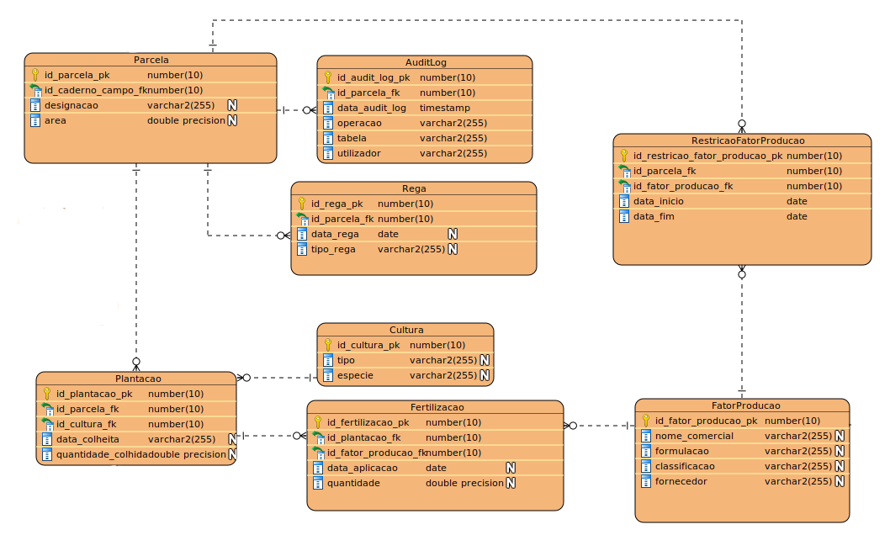

# US 210 - Como Gestor Agrícola, quero gerir o calendário e registar a execução das operações agrícolas na minha exploração agrícola
## 1. Requerimentos

### 1.1. Descrição da User Story

Como Gestor Agrícola, quero gerir o calendário e registar a execução das operações
agrícolas na minha exploração agrícola. As operações agrícolas podem ser de vários tipos, como
irrigação e adubação ou aplicação de qualquer Fator de Produção permitido. Para cada operação, é
necessário registar diversos detalhes, como a forma de aplicação (foliar, fertirrega ou no solo), os
produtos e quantidades aplicadas, a data de realização, etc. A aplicação dos fatores de produção
pode estar sujeita a determinadas restrições dependendo do Setor; ou seja, alguns fatores de
produção podem não ser permitidos em determinados Setores de uma exploração agrícola durante
um determinado período. Estas restrições variam frequentemente em função da zona geográfica e
do período de aplicação. Essas restrições devem ser verificadas no momento da reserva de uma
operação e uma semana antes de aplicá-la.

### 1.2. Clarificações e especificações do cliente

### 1.3. Critérios de aceitação

* **CA1:** Posso registar uma operação concreta para realizar em determinada data e manter um
  calendário de operações.
* **CA2:** As restrições à aplicação dos fatores de produção são verificadas aquando da marcação de uma
  operação no calendário.
* **CA3:** As restrições à aplicação dos factores de produção podem ser verificadas uma semana antes da
  sua aplicação.
* **CA4:** Posso listar todas as restrições de fatores de produção que se aplicam a um determinado Setor
  da minha exploração agrícola numa determinada data.
* **CA5:** Posso listar todas as operações planeadas na minha exploração agrícola durante um
  determinado período por setor, ordenadas por ordem cronológica.

### 1.4. Dependências

Nenhuma encontrada até agora

### 1.5 Dados de Input e Output 

#### CA1/CA2/CA3
**Input:**
* Informação sobre a rega ou fertilização

**Output:**

* Informarção se a operação foi bem sucedida e ID

#### CA4
**Input:**
* Data da restrição
* Setor

**Output:**

* Lista de restrições 

#### CA5
**Input:**
* Data de inicio
* Data de fim
* Ordem da ordenação

**Output:**

* Lista de operações no intervalo de datas por ordem e por setor 

### 1.7. Excerto relevante do modelo de domínio 



# 2. Implementação

* CA1/CA2/CA3
 
````
CREATE OR REPLACE FUNCTION fncAdicionarRega (id_parcela IN Rega.id_parcela_fk%type,
tipo_rega_param IN rega.tipo_rega%type,
data_param IN VARCHAR2
) RETURN Rega.id_rega_pk%type AS

ID_REGA Rega.id_rega_pk%type;                                                        
BEGIN
SAVEPOINT BEFORECALL;
insert into Rega (id_rega_pk, id_parcela_fk, data_rega, tipo_rega)
values (DEFAULT, 1,TO_DATE(data_param, 'dd-mm-yyyy'), 'GRAVIDADE');

    Select Rega.id_rega_pk into ID_REGA from Rega
        where (id_parcela =  rega.id_parcela_fk 
        and LOWER(tipo_rega_param) LIKE LOWER(rega.tipo_rega) and 
        TO_DATE(data_param, 'dd-mm-yyyy') = rega.data_rega);
    DBMS_OUTPUT.PUT_LINE('Rega adicionada com o seguinte id: ');
    RETURN ID_REGA;
EXCEPTION
When too_many_rows then
ROLLBACK TO SAVEPOINT BEFORECALL;
DBMS_OUTPUT.PUT_LINE('Essa REGA ja existe com o seguinte id: ');
Select Rega.id_rega_pk into ID_REGA from Rega
where (id_parcela =  rega.id_parcela_fk
and lower(tipo_rega_param) like lower(rega.tipo_rega) and
TO_DATE(data_param, 'dd-mm-yyyy') = rega.data_rega);
RETURN ID_REGA;
WHEN OTHERS THEN
ROLLBACK TO SAVEPOINT BEFORECALL;
DBMS_OUTPUT.PUT_LINE('Não foi possivel adicionar');
ID_REGA :=-1;
RETURN ID_REGA;
end;
````

````
CREATE OR REPLACE procedure prcAdicionarFertilizacao (id_plantacao IN fertilizacao.id_plantacao_fk%type,
                                                        id_fator_producao IN fertilizacao.id_fator_producao_fk%type,
                                                        quantidade_param in fertilizacao.quantidade%type,
                                                        data_param IN VARCHAR2
                                                        ) AS
 
ID_Parcela Parcela.id_parcela_pk%type;
ID_Fertilizacao Fertilizacao.id_fertilizacao_pk%type;
restricao_ativa exception;
BEGIN
    SAVEPOINT BEFORECALL;
    
    Select plantacao.id_parcela_fk into ID_PARCELA from plantacao Where (plantacao.id_plantacao_pk = id_plantacao);
    
    
    FOR restricao IN (
        SELECT *
          FROM restricaofatorproducao
         WHERE (restricaofatorproducao.id_parcela_fk = id_parcela and restricaofatorproducao.id_fator_producao_fk = id_fator_producao))
   LOOP
      IF (restricao.data_inicio <= TO_DATE(data_param, 'dd-mm-yyyy') and restricao.data_fim >= TO_DATE(data_param, 'dd-mm-yyyy')) then
            raise restricao_ativa;
      end if;
   END LOOP;
    
    insert into Fertilizacao (id_fertilizacao_pk,id_plantacao_fk, id_fator_producao_fk, data_aplicacao, quantidade)
    values (DEFAULT,id_plantacao, id_fator_producao, TO_DATE(data_param, 'dd-mm-yyyy'), quantidade_param);
    
    Select Fertilizacao.id_fertilizacao_pk into ID_Fertilizacao from fertilizacao where(id_plantacao_fk = id_plantacao 
    and id_fator_producao_fk = id_fator_producao 
    and data_aplicacao = TO_DATE(data_param, 'dd-mm-yyyy')
    and quantidade = quantidade_param
    ); 
    DBMS_OUTPUT.PUT_LINE('Foi adicionado uma fertilizacao com o id: ' || id_fertilizacao);
EXCEPTION
    when restricao_ativa then
    ROLLBACK TO SAVEPOINT BEFORECALL;
    DBMS_OUTPUT.PUT_LINE('Não foi possivel adicionar a fertilização devido a exitir uma restrição nessa data');
    WHEN OTHERS THEN
    ROLLBACK TO SAVEPOINT BEFORECALL;
    DBMS_OUTPUT.PUT_LINE('Não foi possivel adicionar a fertilização');
end;

Set serveroutput on    
begin
    prcAdicionarFertilizacao(1,1,2000,'09-02-2023');
end;
````

````
CREATE OR REPLACE FUNCTION fncAdicionarRestricaoFatorProducao (id_parcela IN RestricaoFatorProducao.id_parcela_fk%type,
                                                        id_fator_producao IN RestricaoFatorProducao.id_fator_producao_fk%type,
                                                        data_inicio_param IN VARCHAR2,
                                                        data_fim_param IN varchar2) RETURN RestricaoFatorProducao.id_restricao_fator_producao_pk%type AS
                                                        
ID_RESTRICAO RestricaoFatorProducao.id_restricao_fator_producao_pk%type;                                                        
BEGIN
    SAVEPOINT BEFORECALL;
    
    insert into RestricaoFatorProducao (id_restricao_fator_producao_pk, id_parcela_fk, id_fator_producao_fk, data_inicio,data_fim)
    values (DEFAULT, id_parcela,id_fator_producao, TO_DATE(data_inicio_param, 'dd-mm-yyyy'), TO_DATE(data_fim_param, 'dd-mm-yyyy'));
    
    Select RestricaoFatorProducao.id_restricao_fator_producao_pk into ID_RESTRICAO from RestricaoFatorProducao
        where (id_parcela =  restricaofatorproducao.id_parcela_fk 
        and id_fator_producao = restricaofatorproducao.id_fator_producao_fk and 
        TO_DATE(data_inicio_param, 'dd-mm-yyyy') = restricaofatorproducao.data_inicio and 
         TO_DATE(data_fim_param, 'dd-mm-yyyy') = restricaofatorproducao.data_fim);
    DBMS_OUTPUT.PUT_LINE('Restrição de aplicação  do Fator de Producao Adicionado com o seguinte id: ');
    RETURN ID_RESTRICAO;
EXCEPTION
     When too_many_rows then
     DBMS_OUTPUT.PUT_LINE('Essa restrição ja existe com o seguinte id: ');
     ROLLBACK TO SAVEPOINT BEFORECALL;
     Select RestricaoFatorProducao.id_restricao_fator_producao_pk into ID_RESTRICAO from RestricaoFatorProducao
        where (id_parcela =  restricaofatorproducao.id_parcela_fk 
        and id_fator_producao = restricaofatorproducao.id_fator_producao_fk and 
        TO_DATE(data_inicio_param, 'dd-mm-yyyy') = restricaofatorproducao.data_inicio and 
         TO_DATE(data_fim_param, 'dd-mm-yyyy') = restricaofatorproducao.data_fim);
    RETURN ID_RESTRICAO;
    WHEN OTHERS THEN
    ROLLBACK TO SAVEPOINT BEFORECALL;
    DBMS_OUTPUT.PUT_LINE('Não foi possivel adicionar');
    ID_RESTRICAO :=-1;
    RETURN ID_RESTRICAO;
end;

set serveroutput on
begin
    DBMS_OUTPUT.PUT_LINE(fncAdicionarRestricaoFatorProducao(1,1,'18-07-2023','29-06-2023'));
end;

````

* CA4

```
CREATE OR REPLACE procedure prcListarRestricaoFatorProducaoNumDeterminadoSetorNumaData(id_parcela IN restricaofatorproducao.id_parcela_fk%type,                                                      
                                                        data_param IN VARCHAR2
                                                        ) AS
 
BEGIN
    SAVEPOINT BEFORECALL;    
    FOR restricao IN (
        SELECT *
          FROM restricaofatorproducao
         WHERE (restricaofatorproducao.id_parcela_fk = id_parcela))
   LOOP
      IF (restricao.data_inicio <= TO_DATE(data_param, 'dd-mm-yyyy') and restricao.data_fim >= TO_DATE(data_param, 'dd-mm-yyyy')) then
            DBMS_OUTPUT.PUT_LINE('ID : ' || restricao.id_restricao_fator_producao_pk || ' | ID PARCELA :  ' || restricao.ID_PARCELA_FK || ' | ID FATOR PRODUCAO : ' || restricao.ID_Fator_producao_fk 
            || ' | DATA INICIO : ' || restricao.data_inicio|| ' | DATA INICIO : ' ||  restricao.data_fim);
      end if;
   END LOOP;

EXCEPTION
    WHEN OTHERS THEN
    ROLLBACK TO SAVEPOINT BEFORECALL;
    DBMS_OUTPUT.PUT_LINE('Não foi listas as restrições');
end;
```

* CA5

```
create or replace procedure prcListarTodasAsOperacoesNumIntervaloDeTempoPorSetor(data_inicio in VARCHAR2,
                            data_fim in Varchar2,
                            ordem in Varchar2) as


cursor c_asc is (select * from
        (( select
          'Rega' as TableSource,
          id_rega_pk as id,
          data_rega as datainicial,
          id_parcela_fk as id_parcela
       from
          rega
       )
UNION
   ( select
          'Fertilizacao' as TableSource,
          id_fertilizacao_pk as id,
          data_aplicacao as datainicial,
          (select id_parcela_fk from plantacao where( id_plantacao_fk = plantacao.id_plantacao_pk)) as id_parcela
       from
          Fertilizacao 
      ))where (TO_DATE(data_INICIO, 'dd-mm-yyyy') <= datainicial and TO_DATE(data_fim, 'dd-mm-yyyy') >= datainicial)) order by id_parcela,datainicial;
      
cursor c_desc is (select * from
        (( select
          'Rega' as TableSource,
          id_rega_pk as id,
          data_rega as datainicial,
          id_parcela_fk as id_parcela
       from
          rega 
       ) 
UNION
   ( select
          'Fertilizacao' as TableSource,
          id_fertilizacao_pk as id,
          data_aplicacao as datainicial,
          (select id_parcela_fk from plantacao where( id_plantacao_fk = plantacao.id_plantacao_pk)) as id_parcela
       from
          Fertilizacao 
      ))where (TO_DATE(data_INICIO, 'dd-mm-yyyy') <= datainicial and TO_DATE(data_fim, 'dd-mm-yyyy') >= datainicial)) order by id_parcela,datainicial desc;      
      
dummy c_asc%Rowtype;
ordem_invalida EXCEPTION;
setor number :=0;
Begin
    
    IF (UPPER(ordem) = 'ASC' OR UPPER(ordem) = 'ASCENDENTE') THEN
        OPEN c_asc;
        DBMS_OUTPUT.PUT_LINE('Operações por ordem ascendente:');
        LOOP
        FETCH c_asc INTO dummy;
            EXIT WHEN c_asc%NOTFOUND;
                if(dummy.id_parcela != setor) then 
                    setor:= dummy.id_parcela;
                    DBMS_OUTPUT.PUT_LINE('');
                    DBMS_OUTPUT.PUT_LINE('Setor ' || setor);
                    DBMS_OUTPUT.PUT_LINE('');                    
                end if;
                IF (dummy.TableSource like 'Rega') then
                    DBMS_OUTPUT.PUT_LINE('Operação: ' || dummy.TableSource || '         | ID: ' || dummy.id || ' | Setor: ' || dummy.id_parcela || '| Data: ' || dummy.datainicial);
                    ElsIF (dummy.TableSource like 'Fertilizacao') then
                        DBMS_OUTPUT.PUT_LINE('Operação: ' || dummy.TableSource || ' | ID: ' || dummy.id || ' | Setor: ' || dummy.id_parcela || '| Data: ' || dummy.datainicial);
                end if;
            END LOOP;
            CLOSE c_asc;
    ELSIF(UPPER(ordem) = 'DESC' OR UPPER(ordem) = 'DESCENDENTE') THEN
        OPEN c_desc;
        DBMS_OUTPUT.PUT_LINE('Operações por ordem descendente:');
        LOOP
        FETCH c_desc INTO dummy;
            EXIT WHEN c_desc%NOTFOUND;
                if(dummy.id_parcela != setor) then 
                    setor:= dummy.id_parcela;
                    DBMS_OUTPUT.PUT_LINE('');
                    DBMS_OUTPUT.PUT_LINE('Setor ' || setor);
                    DBMS_OUTPUT.PUT_LINE('');
                end if;
                IF (dummy.TableSource like 'Rega') then
                     DBMS_OUTPUT.PUT_LINE('Operação: ' || dummy.TableSource || '         | ID: ' || dummy.id || ' | Setor: ' || dummy.id_parcela || '| Data: ' || dummy.datainicial);
                    ElsIF (dummy.TableSource like 'Fertilizacao') then
                        DBMS_OUTPUT.PUT_LINE('Operação: ' || dummy.TableSource || ' | ID: ' || dummy.id || ' | Setor: ' || dummy.id_parcela || '| Data: ' || dummy.datainicial);
                end if;
            END LOOP;
            CLOSE c_desc;
    ELSE
        RAISE ordem_invalida;
    END IF;

EXCEPTION
    WHEN ordem_invalida THEN
        DBMS_OUTPUT.PUT_LINE('Parâmetro de ordenação inválida. Por favor insira "descendente" ou "ascendente');
    WHEN OTHERS THEN
        DBMS_OUTPUT.PUT_LINE('Parâmetros inválidos.');
end;

```