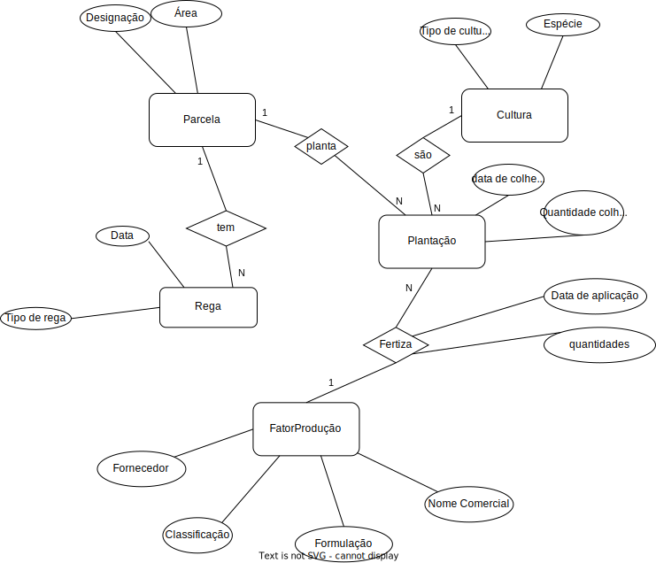

# US211 – Como Gestor Agrícola, quero adaptar/remarcar as operações planeadas na minha exploração agrícola 

### 1.1. Descrição da User Story

Como Gestor Agrícola, quero adaptar/remarcar as operações planeadas para minha
exploração agrícola em função dos dados adquiridos dos sensores em campo (temperatura,
humidade) e meteorologia.


### 1.2. Clarificações e especificações do cliente

### 1.3. Critérios de aceitação

* **CA1:**  Qualquer operação que ainda não tenha sido realizada pode ser cancelada
* **CA2:** Qualquer operação ainda não realizada pode ser atualizada em qualquer um de seus parâmetros (data de aplicação, quantidades, produtos a aplicar, etc.).
* **CA3:** Qualquer operação já realizada não pode ser cancelada ou atualizada.

### 1.4. Dependências

* US 210

### 1.5 Dados de Input e Output 

#### CA1
**Input:**
   * Id da operação

**Output:**
   * Sucesso da operação

#### CA2
**Input:**
   * Id da operação 
   * Parâmetro a atualizar

**Output:**
   * Sucesso da operação

### 1.7. Excerto relevante do modelo de domínio 



# 2. Implementação

* CA1
  * Exemplo do procedimento para cancelar uma fertilização

```
CREATE OR REPLACE PROCEDURE prcCancelarFertilizacao(id_fertilizacao_param FERTILIZACAO.ID_FERTILIZACAO_PK%TYPE) AS

    fertilizacao_para_atualizar FERTILIZACAO%ROWTYPE;

    fertilizacao_ja_realizada EXCEPTION;

BEGIN

    --dá throw a NO_DATA_FOUND caso não encontre nada
SELECT * INTO fertilizacao_para_atualizar FROM FERTILIZACAO
WHERE ID_FERTILIZACAO_PK = id_fertilizacao_param;


IF(fertilizacao_para_atualizar.DATA_APLICACAO <= SYSDATE)THEN
        RAISE fertilizacao_ja_realizada;
end if;

DELETE FROM FERTILIZACAO
WHERE ID_FERTILIZACAO_PK = id_fertilizacao_param;

DBMS_OUTPUT.PUT_LINE('Operação realizada com sucesso.');

EXCEPTION
    WHEN NO_DATA_FOUND THEN
        DBMS_OUTPUT.PUT_LINE('Não existe uma fertilização com este id.');
WHEN fertilizacao_ja_realizada THEN
        DBMS_OUTPUT.PUT_LINE('Uma fertilização já realizada não pode ser cancelada.');
END;
```


* CA2

  * Exemplo do procedimento para atualizar a data de uma rega

```
CREATE OR REPLACE PROCEDURE prcAtualizarDataRega(id_rega_param Rega.id_rega_pk%TYPE,
                                                 data_param Rega.data_rega%TYPE) AS

    rega_para_atualizar REGA%ROWTYPE;

    rega_ja_realizada EXCEPTION;
    data_invalida EXCEPTION;

BEGIN

SELECT * INTO rega_para_atualizar FROM REGA
WHERE rega.id_rega_pk = id_rega_param;

IF(rega_para_atualizar.data_rega <= SYSDATE) THEN
        RAISE rega_ja_realizada;
END IF;

    IF (data_param <= SYSDATE) THEN
        RAISE data_invalida;
END IF;

UPDATE REGA
SET data_rega = data_param
WHERE id_rega_pk = id_rega_param;

DBMS_OUTPUT.PUT_LINE('Operação realizada com sucesso.');

EXCEPTION
    WHEN NO_DATA_FOUND THEN
        DBMS_OUTPUT.PUT_LINE('Não existe uma rega com este id.');
WHEN rega_ja_realizada THEN
        DBMS_OUTPUT.PUT_LINE('Uma rega já realizada não pode ser atualizada.');
WHEN data_invalida THEN
        DBMS_OUTPUT.PUT_LINE('A nova data não pode ser anterior ou igual à data atual.');

END;
```
