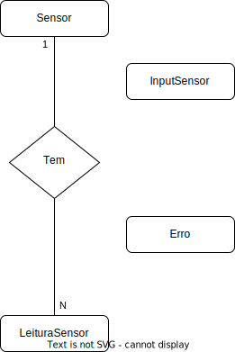

# US 212 - Como Gestor Agrícola, quero preparar o meu sistema para persistir na minha base de dados os valores registados pelos sensores que estão disponíveis numa tabela que é atualizada

## 1. Requerimentos

### 1.1. Descrição da User Story

US212 – Como Gestor Agrícola, quero preparar o meu sistema para que, no futuro, as operações
planeadas possam ser adaptadas de forma automática às condições climatéricas. Para tal, quero
começar por persistir na minha base de dados os valores registados pelos sensores que estão
disponíveis numa tabela que é atualizada com a seguinte informação:

a) identificador do sensor (string com 5 caratéres),

b) tipo de sensor (string com dois caratéres),

c) valor lido (um número inteiro entre 0 e 100 para qualquer sensor),

d) valor de referência (número inteiro, é único para cada sensor) 

e) instante da leitura (data, hora, minuto no formato HH:MM)

f) o tipo de sensor é caracterizado da seguinte forma:

 HS – Sensor de humidade do solo

 Pl – Sensor de pluviosidade

 TS – Sensor de temperatura do solo

 VV – Sensor de velocidade do vento

 TA – Sensor de temperatura atmosférica

 HA – Sensor de humidade do ar

 PA – Sensor de pressão atmosférica

A tabela em que são registadas estas leituras tem o seguinte esquema:
**input_sensor(input_string VARCHAR(25)).**

### 1.2. Clarificações e especificações do cliente

* FALTAM ESPECIFICAÇÕES DO CLIENTE

### 1.3. Critérios de aceitação

**CA1:** Existe uma função que devolve o n-ésimo elemento de cada tuplo de input_sensor

**CA2:** É possível transferir as leituras dos sensores para um conjunto de tabelas na 3FN. Os registos
de input_sensor transferidos com sucesso são removidos dessa tabela.

**CA3:** Só são transferidos os registos de input_sensor validados de acordo com as
especificações dadas nas alíneas a) a f).

**CA4:** Se a tabela input_sensor tiver registos com erros de formatação, estes são identificados e
não são transferidos para as tabelas na 3FN. A tabela input_sensor é processada na
totalidade mas só os registos sem erros são introduzidos no conjunto de tabelas a criar para o
efeito.

**CA5:** Cada processo de leitura de dados dos sensores é registado sendo inseridos os seguintes
dados: data e hora de execução do processo, número de registos lidos, número de registos
inseridos (sem erros) e o número de registos não inseridos devido a erros de formatação.
Relativamente aos registos não inseridos devido a erros de formatação é necessário persistir
também o identificador do sensor e o número de erros identificados originados por cada
sensor.

**CA6:** Assim que se conclui um processo de leitura de um ficheiro é mostrado um resumo do
processo que mostra: o número total de registos lidos, o número de registos transferidos (sem
erros) e o número de registos não transferidos devido a erros de formatação.

### 1.4. Dependências

* US201 - Nomenclatura da base de dados
* US202 - Modelo do domínio
* US204 - Bootstrap da base de dados

### 1.5 Dados de Input e Output

#### CA1

**Input:** 

*   Numero do tuplo a retornar 

#### CA2 CA3 CA4 CA5 CA6
**Input:**

*   Input_sensor

**Output:**

*   Resumo do processo que mostra: o número total de registos lidos, o número de registos transferidos (sem erros) e o número de registos não transferidos devido a erros de formatação.

## 2. Modelo Concetual



## 3. Implementação

* CA1 CA2 CA3 CA4 CA5 CA6:

``` 
 CREATE OR REPLACE FUNCTION input_string_to_tuple(
    p_input_sensor INPUTSENSOR.INPUT_STRING%type
)
    RETURN array_t
    IS
    v_id_sensor        CHAR(5);
    v_tipo_sensor      char(2);
    v_valor_lido       char(3);
    v_valor_referencia char(3);
    v_dia        char(2);
    v_mes        char(2);
    v_ano        char(4);
    v_hora        char(2);
    v_minuto        char(2);
    v_data char(16);
    v_num_erros number(2);
    v_tuple array_t;
BEGIN
    v_num_erros := 0;
    if LENGTH(p_input_sensor) != 25 then
        v_num_erros := v_num_erros + 1;
        v_tuple := array_t();
        v_tuple.extend(6);
        v_tuple(1) := SUBSTR(p_input_sensor, 1, 5);
        v_tuple(2) := 'ERRO';
        v_tuple(3) := 'ERRO';
        v_tuple(4) := 'ERRO';
        v_tuple(5) := 'ERRO';
        v_tuple(6) := v_num_erros || '';
return v_tuple;
end if;
    v_id_sensor := SUBSTR(p_input_sensor, 1, 5);
    v_tipo_sensor := SUBSTR(p_input_sensor, 6, 2);
    v_valor_lido := SUBSTR(p_input_sensor, 8, 3);
    v_valor_referencia := SUBSTR(p_input_sensor, 11, 3);
    v_dia := SUBSTR(p_input_sensor, 14, 2);
    v_mes := SUBSTR(p_input_sensor, 16, 2);
    v_ano := SUBSTR(p_input_sensor, 18, 4);
    v_hora := SUBSTR(p_input_sensor, 22, 2);
    v_minuto := SUBSTR(p_input_sensor, 24, 2);
    v_data := v_dia || '/' || v_mes || '/' || v_ano || ' ' || v_hora || ':' || v_minuto;

    v_tuple := array_t();
    v_tuple.extend(6);
    v_tuple(1) := v_id_sensor;
    v_tuple(2) := v_tipo_sensor;
    v_tuple(3) := v_valor_lido;
    v_tuple(4) := v_valor_referencia;
    v_tuple(5) := v_dia || '/' || v_mes || '/' || v_ano || ' ' || v_hora || ':' || v_minuto;
    -- dbms_output.put_line('ID: ' || v_tuple(1) || ' Tipo: ' || v_tuple(2) || ' Valor lido: ' || v_tuple(3) || ' Valor referencia: ' || v_tuple(4) || ' Data: ' || v_tuple(5));

    -- verificar se v_tipo_sensor é válido
    if  UPPER(v_tipo_sensor) not in ('HS', 'PL', 'TS', 'VV', 'TA', 'HA', 'PA') then
        DBMS_OUTPUT.PUT_LINE( 'Tipo de sensor inválido');
        v_num_erros := v_num_erros + 1;
end if;

    -- verificar se v_valor_lido é válido
    if to_number(v_valor_lido) < 0 or to_number(v_valor_lido) > 100 then
        DBMS_OUTPUT.PUT_LINE( 'Valor lido inválido');
        v_num_erros := v_num_erros + 1;
end if;

    -- verificar se v_valor_referencia é válido
    if to_number(v_valor_referencia) < 0 or to_number(v_valor_referencia) > 100 then
        DBMS_OUTPUT.PUT_LINE( 'Valor de referencia inválido');
        v_num_erros := v_num_erros + 1;
end if;

    -- verificar se v_data é válida
    if TO_DATE(v_data, 'DD/MM/YYYYHH24:MI') is null then
        raise_application_error(-20001, 'Data Invalida');
end if;

    v_tuple(6) := v_num_erros || '';
return v_tuple;
exception
    when others then
        DBMS_OUTPUT.PUT_LINE( 'Data inválida');
        v_num_erros := v_num_erros + 1;
        v_tuple := array_t();
        v_tuple.extend(6);
        v_tuple(1) := SUBSTR(p_input_sensor, 1, 5);
        v_tuple(2) := 'ERRO';
        v_tuple(3) := 'ERRO';
        v_tuple(4) := 'ERRO';
        v_tuple(5) := 'ERRO';
        v_tuple(6) := v_num_erros || '';
return v_tuple;
END;

CREATE OR REPLACE function get_tuple (p_input_sensor INPUTSENSOR.INPUT_STRING%type, p_n number)
    return varchar2
    is
    v_tuple array_t;
begin
    if p_n < 1 or p_n > 5 then
        raise_application_error(-20001, 'Número inválido');
end if;
    v_tuple := input_string_to_tuple(p_input_sensor);
return v_tuple(p_n);
end;

CREATE OR REPLACE procedure insert_all_input_sensor
    is
    n_total_registos_lidos  number := 0;
    n_registos_transferidos number := 0;
    n_registos_errados      number := 0;
    v_tuple                 array_t;
    v_input_sensor_atual    INPUTSENSOR.INPUT_STRING%type;
    v_contador              number := 0;
CURSOR c_input_sensor IS
SELECT *
FROM INPUTSENSOR;
begin
OPEN c_input_sensor;
LOOP
FETCH c_input_sensor into v_input_sensor_atual;
        EXIT WHEN c_input_sensor%notfound;
        v_tuple := input_string_to_tuple(v_input_sensor_atual);
        n_total_registos_lidos := n_total_registos_lidos + 1;
        DBMS_OUTPUT.PUT_LINE('ID: ' || v_tuple(1) || ' Tipo: ' || v_tuple(2) || ' Valor lido: ' || v_tuple(3) ||
                             ' Valor referencia: ' || v_tuple(4) || ' Data: ' || v_tuple(5) || ' Erros: ' ||
                             v_tuple(6));
        if (v_tuple(6) = '0') then
Select count(id_sensor_pk)
into v_contador
from Sensor
where to_number(id_sensor_pk) = to_number(v_tuple(1));
if (v_contador = 0) then
                insert into Sensor values (v_tuple(1), 1, v_tuple(2), v_tuple(4));
end if;
            n_registos_transferidos := n_registos_transferidos + 1;
insert into LeituraSensor
values (default, v_tuple(1), v_tuple(3), TO_DATE(v_tuple(5), 'DD/MM/YYYYHH24:MI'));
delete from InputSensor where input_string = v_input_sensor_atual;
else
            insert into Erro values (default, v_tuple(6), v_tuple(1));
            n_registos_errados := n_registos_errados + 1;
end if;
END LOOP;
CLOSE c_input_sensor;
DBMS_OUTPUT.PUT_LINE(SYSDATE);
    DBMS_OUTPUT.PUT_LINE('Total de registos lidos: ' || n_total_registos_lidos || 'Total de registos transferidos: ' ||
                         n_registos_transferidos || 'Total de registos errados: ' || n_registos_errados);
commit;
end;
```