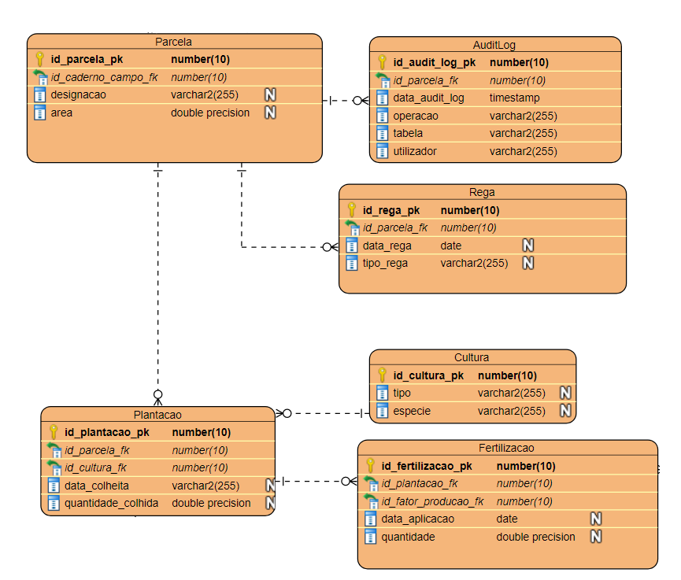

# US 213 - Como Gestor Agrícola, quero ter acesso a pistas de auditoria das operações agrícolas planeadas ou realizadas em determinado Setor da minha exploração agrícola

## 1. Requerimentos

### 1.1. Descrição da User Story

Como Gestor Agrícola, quero ter acesso a pistas de auditoria das operações agrícolas
planeadas ou realizadas em determinado Setor da minha exploração agrícola, ou seja, quero ter
acesso a uma lista de todas as alterações realizadas na bse de dados, por ordem cronológica. Para
cada alteração quero saber: o utilizador/login que a realizou, a data e hora em que a alteração foi
realizada e o tipo de alteração (INSERT, UPDATE, DELETE).

### 1.2. Clarificações e especificações do cliente

### 1.3. Critérios de aceitação

* **CA1:** Existe uma tabela para registo de pistas de auditoria, ou seja, para o registo de todas as
  operações de escrita na base de dados envolvendo um determinado setor da minha exploração
  agrícola.
* **CA2:** Os mecanismos apropriados para gravação de operações de escrita (INSERT, UPDATE,
  DELETE) estão implementados.
* **CA3:** É implementado um processo de consulta de pistas de auditoria simples e eficaz.

### 1.4. Dependências

Nenhuma encontrada até agora

### 1.5 Dados de Input e Output 

#### CA1

#### CA3
**Input:**
* Ordem de ordenação 

**Output:**

* Pista de auditoria por ordem cronologica

### 1.7. Excerto relevante do modelo de domínio 



# 2. Implementação

* CA1

``` 
 CREATE TABLE AuditLog
  (
  id_audit_log_pk     number(10) GENERATED AS IDENTITY,
  id_parcela_fk       number(10) NOT NULL,
  data_audit_log      timestamp NOT NULL,
  operacao            varchar2(255) NOT NULL,
  tabela              varchar2(255) NOT NULL,
  utilizador          varchar2(255) NOT NULL,
  PRIMARY KEY (id_audit_log_pk),
  CONSTRAINT ck_operacao CHECK (UPPER(operacao) LIKE ('UPDATE') OR UPPER(operacao) LIKE('INSERT') OR UPPER(operacao) LIKE('DELETE'))
  );
  
  ALTER TABLE AuditLog
    ADD CONSTRAINT fk_AuditLog_id_parcela_fk FOREIGN KEY (id_parcela_fk) REFERENCES Parcela (id_parcela_pk);
```

* CA2

```
CREATE or replace TRIGGER TR_FERTILIZACAO_AUDITLOG after Insert or Update or Delete ON Fertilizacao
REFERENCING NEW AS NEW OLD AS OLD
For each row

    DECLARE 
    v_user varchar2 (30);
    v_time timeStamp;
    v_operacao varchar2 (6);
    v_table varchar(12) := 'Fertilizacao';
    v_Parcela_id Parcela.id_parcela_pk%type;
    
BEGIN
    SELECT user,systimestamp INTO v_user, v_time  FROM dual; 
    IF DELETING THEN 
        Select plantacao.id_parcela_fk into v_Parcela_id from plantacao Where (plantacao.id_plantacao_pk = :OLD.id_plantacao_fk);       
        v_operacao := 'DELETE';
    END IF;

    IF INSERTING THEN 
        Select plantacao.id_parcela_fk into v_Parcela_id from plantacao Where (plantacao.id_plantacao_pk = :NEW.id_plantacao_fk);    
        v_operacao := 'INSERT';
    END IF;
        
    IF UPDATING THEN
        Select plantacao.id_parcela_fk into v_Parcela_id from plantacao Where (plantacao.id_plantacao_pk = :NEW.id_plantacao_fk);    
        v_operacao := 'UPDATE';
    END IF;
    
    insert into Auditlog (id_audit_log_pk,id_parcela_fk,data_audit_log,operacao,tabela,utilizador) values (DEFAULT,v_parcela_id,v_time,v_operacao,v_table,v_user);

end;
```

```
CREATE or replace TRIGGER TR_PLANTACAO_AUDITLOG after Insert or Update or Delete ON Plantacao
REFERENCING NEW AS NEW OLD AS OLD
For each row

    DECLARE 
    v_user varchar2 (30);
    v_time timeStamp;
    v_operacao varchar2 (6);
    v_table varchar(12) := 'Plantacao';
    v_Parcela_id Parcela.id_parcela_pk%type;
    
BEGIN
    SELECT user,systimestamp INTO v_user, v_time  FROM dual; 
    IF DELETING THEN 
        v_Parcela_id := :OLD.id_parcela_fk;       
        v_operacao := 'DELETE';
    END IF;

    IF INSERTING THEN 
        v_Parcela_id := :NEW.id_parcela_fk;       
        v_operacao := 'INSERT';
    END IF;
        
    IF UPDATING THEN
        v_Parcela_id := :NEW.id_parcela_fk;       
        v_operacao := 'UPDATE';
    END IF;
    
    insert into Auditlog (id_audit_log_pk,id_parcela_fk,data_audit_log,operacao,tabela,utilizador) values (DEFAULT,v_parcela_id,v_time,v_operacao,v_table,v_user);

end;
```

```
CREATE or replace TRIGGER TR_REGA_AUDITLOG after Insert or Update or Delete ON Rega
REFERENCING NEW AS NEW OLD AS OLD
For each row

    DECLARE 
    v_user varchar2 (30);
    v_time timeStamp;
    v_operacao varchar2 (6);
    v_table varchar(12) := 'Rega';
    v_Parcela_id Parcela.id_parcela_pk%type;
    
BEGIN
    SELECT user,systimestamp INTO v_user, v_time  FROM dual; 
    IF DELETING THEN 
        v_Parcela_id := :OLD.id_parcela_fk;       
        v_operacao := 'DELETE';
    END IF;

    IF INSERTING THEN 
        v_Parcela_id := :NEW.id_parcela_fk;       
        v_operacao := 'INSERT';
    END IF;
        
    IF UPDATING THEN
        v_Parcela_id := :NEW.id_parcela_fk;       
        v_operacao := 'UPDATE';
    END IF;
    
    insert into Auditlog (id_audit_log_pk,id_parcela_fk,data_audit_log,operacao,tabela,utilizador) values (DEFAULT,v_parcela_id,v_time,v_operacao,v_table,v_user);

end;

```
* CA3

```
create or replace PROCEDURE prcOrdenarPeloTempoAuditLog (ordem varchar2) AS
   
    audit_dummy AUDITLOG%ROWTYPE;
    CURSOR c_audit_desc is SELECT * FROM AuditLog ORDER BY Data_audit_log DESC;
    CURSOR c_audit_asc is SELECT * FROM AuditLog ORDER BY Data_audit_log ASC;
    ordem_invalida EXCEPTION;

BEGIN
    IF (UPPER(ordem) = 'ASC' OR UPPER(ordem) = 'ASCENDENTE') THEN
        OPEN c_audit_asc;
        DBMS_OUTPUT.PUT_LINE('Audit log por ordem ascendente das datas :');
        LOOP
FETCH c_audit_asc INTO audit_dummy;
            EXIT WHEN c_audit_asc%NOTFOUND;
            DBMS_OUTPUT.PUT_LINE('ID : ' || audit_dummy.ID_AUDIT_LOG_PK || ' | ID PARCELA :  ' || audit_dummy.ID_PARCELA_FK || ' | DATA : ' || audit_dummy.Data_audit_log 
            || ' | Operacao : ' || audit_dummy.operacao || ' | Tabela : ' || audit_dummy.tabela || ' | Utilizador : ' || audit_dummy.utilizador);
END LOOP;
CLOSE c_audit_asc;
ELSIF (UPPER(ordem) = 'DESC' OR UPPER(ordem) = 'DESCENDENTE') THEN
        OPEN c_audit_desc;
        DBMS_OUTPUT.PUT_LINE('Audit log por ordem descendente das datas :');
        LOOP
FETCH c_audit_desc INTO audit_dummy;
            EXIT WHEN c_audit_desc%NOTFOUND;
            DBMS_OUTPUT.PUT_LINE('ID : ' || audit_dummy.ID_AUDIT_LOG_PK || ' | ID PARCELA :  ' || audit_dummy.ID_PARCELA_FK || ' | DATA : ' || audit_dummy.Data_audit_log 
            || ' | Operacao : ' || audit_dummy.operacao || ' | Tabela : ' || audit_dummy.tabela || ' | Utilizador : ' || audit_dummy.utilizador);
            
END LOOP;
CLOSE c_audit_desc;
ELSE
        RAISE ordem_invalida;
END IF;
EXCEPTION
    WHEN ordem_invalida THEN
        DBMS_OUTPUT.PUT_LINE('Parâmetro de ordenação inválida.');
WHEN OTHERS THEN
        DBMS_OUTPUT.PUT_LINE('Não foi possivel ordenar.');
END;
```