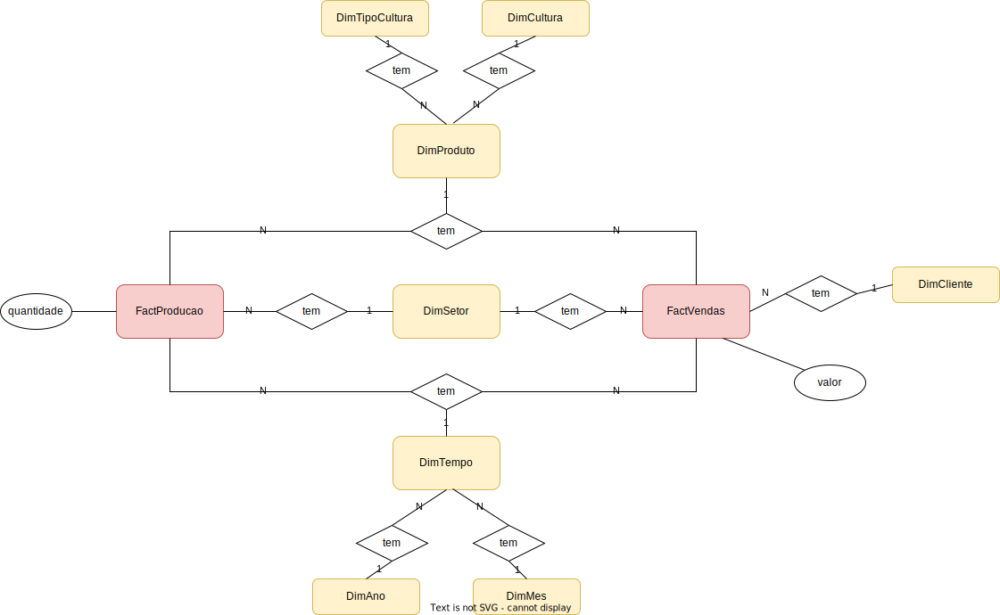

# US 214 - Como Gestor Agrícola, pretendo desenvolver um modelo de dados para construir um DataWarehouse para análise de produção e vendas

## 1. Requerimentos

### 1.1. Descrição da User Story

   Como Gestor Agrícola, pretendo desenvolver um modelo de dados para construir um Data
Warehouse para análise de produção e vendas. Os factos a serem analisados são “produção em
toneladas” e “vendas em milhares de euros". As dimensões a considerar são Tempo, Setor, Produto
e Cliente. A dimensão Tempo tem uma hierarquia com os seguintes níveis: Ano, Mês. A dimensão
Produto está sujeita à seguinte hierarquia: Tipo de cultura, Cultura. Uma estimativa da cardinalidade
superior das tabelas de dimensões e fatos deve ser indicada e justificada/comentada.


### 1.2. Clarificações e especificações do cliente
* Pergunta:
  A Data Warehouse a desenvolver nesta US tem de estar ligada à Data Base principal?
  Ou seja, os inserts/updates/deletes da Data Base principal afetam os dados existentes na Data Warehouse?
  - Resposta :
    Podem gerar as tabelas para o datawarehouse (dw) no schema da bd operacional.
    Não é suposto implementarem os mecanismos de sincronismo entre a bd operacional e o dw; daí a necessidade de criar o script que faça o bootstrap do dw

### 1.3. Critérios de aceitação

* **CA1:** As tabelas de factos estão devidamente identificadas e descritas.
* **CA2:** As tabelas de dimensões estão devidamente identificadas e descritas.
* **CA3:** O modelo Star ou Snowflake é consistente com a finalidade do data warehouse, bem como
  com as tabelas de factos e dimensões identificadas anteriormente.
* **CA4:** A estimativa das cardinalidades é coerente com o modelo de dados e devidamente justificada.
* **CA5:** Um script SQL para carregar o esquema Star/Snowflake com dados suficientes para suportar uma
  prova de conceito está disponível e é executado sem erros.
* **CA6:** Um script SQL para consultar o data warehouse e suportar uma prova de conceito está
  disponível e é executado sem erros. Este script responde as seguintes perguntas:
  - a) Qual é a evolução da produção de uma determinada cultura num determinado setor ao longo
  dos últimos cinco anos?
  - b) Comparar as vendas de um ano com outro?
  - c) Analisar a evolução das vendas mensais por tipo de cultura?

### 1.4. Dependências

Nenhuma encontrada até agora

### 1.5 Dados de Input e Output 

#### CA6 a)
**Input:**
   * Id da cultura
   * Id do setor

**Output:**
   * A evolução da produção nos últimos 5 anos.

#### CA6 b)
**Input:**
   * Primeiro ano
   * Segundo ano

**Output:**
   * Diferença de vendas entre o segundo ano e o primeiro ano.

#### CA6 c)
**Input:**
* Mês da data1
* Ano da data1
* Mês da data2
* Ano da data2
* Id do tipo de cultura

**Output:**
* A evolução de vendas mensais entre os intervalos de tempo inseridos.

### 1.7. Excerto relevante do modelo de domínio 



# 2. Implementação

* CA6 a)

```
CREATE OR REPLACE PROCEDURE prcEvolucaoProducaoUltimosCincoAnos(id_cultura DimCultura.ID_DIM_CULTURA_PK%TYPE,
                                                  id_setor DimSetor.ID_DIM_SETOR_PK%TYPE) AS

    sum_producao_primeiro_ano FactProducao.quantidade%TYPE;
    sum_producao_segundo_ano FactProducao.quantidade%TYPE;
    primeiro_ano DIMANO.ID_DIM_ANO_PK%TYPE;
    segundo_ano DIMANO.ID_DIM_ANO_PK%TYPE;
    count_producao number;
    dif_producao FactProducao.quantidade%TYPE;
    this_year varchar(255);
    this_year_number number;
    counter_ano number;

BEGIN
SELECT to_char(sysdate, 'YYYY') INTO this_year FROM DUAL;
this_year_number := CAST(this_year AS NUMBER);
counter_ano := 0;
LOOP
EXIT WHEN primeiro_ano = this_year_number - 5;
    primeiro_ano := this_year_number - counter_ano - 1;
    segundo_ano := this_year_number - counter_ano;
    counter_ano:= counter_ano + 1;


-- PRIMEIRO ANO
----------------------------------//---------------------------------------
SELECT COUNT(F.quantidade) INTO count_producao FROM FactProducao F
                                                        INNER JOIN DIMTEMPO T ON F.ID_DIM_TEMPO_FK = T.ID_DIM_TEMPO_PK
                                                        INNER JOIN DIMPRODUTO P ON F.ID_DIM_PRODUTO_FK = P.ID_DIM_PRODUTO_PK
                                                        INNER JOIN DimSetor S ON F.id_dim_setor_fk = S.id_dim_setor_pk
WHERE T.id_dim_ano_fk = primeiro_ano AND P.ID_DIM_TIPO_CULTURA_FK = id_cultura AND F.id_dim_setor_fk = id_setor;

IF count_producao != 0 THEN
            -- SUM ANO
SELECT SUM(F.quantidade) INTO sum_producao_primeiro_ano FROM FactProducao F
                                                                 INNER JOIN DIMTEMPO T ON F.ID_DIM_TEMPO_FK = T.ID_DIM_TEMPO_PK
                                                                 INNER JOIN DIMPRODUTO P ON F.ID_DIM_PRODUTO_FK = P.ID_DIM_PRODUTO_PK
                                                                 INNER JOIN DimSetor S ON F.id_dim_setor_fk = S.id_dim_setor_pk
WHERE T.id_dim_ano_fk = primeiro_ano AND P.ID_DIM_TIPO_CULTURA_FK = id_cultura AND F.id_dim_setor_fk = id_setor;

ELSE sum_producao_primeiro_ano := 0;
END IF;

----------------------------------//---------------------------------------
-- SEGUNDO ANO
SELECT COUNT(F.quantidade) INTO count_producao FROM FactProducao F
                                                        INNER JOIN DIMTEMPO T ON F.ID_DIM_TEMPO_FK = T.ID_DIM_TEMPO_PK
                                                        INNER JOIN DIMPRODUTO P ON F.ID_DIM_PRODUTO_FK = P.ID_DIM_PRODUTO_PK
                                                        INNER JOIN DimSetor S ON F.id_dim_setor_fk = S.id_dim_setor_pk
WHERE T.id_dim_ano_fk = segundo_ano AND P.ID_DIM_TIPO_CULTURA_FK = id_cultura AND F.id_dim_setor_fk = id_setor;

IF count_producao != 0 THEN
            -- SUM ANO
SELECT SUM(F.quantidade) INTO sum_producao_segundo_ano FROM FactProducao F
                                                                INNER JOIN DIMTEMPO T ON F.ID_DIM_TEMPO_FK = T.ID_DIM_TEMPO_PK
                                                                INNER JOIN DIMPRODUTO P ON F.ID_DIM_PRODUTO_FK = P.ID_DIM_PRODUTO_PK
                                                                INNER JOIN DimSetor S ON F.id_dim_setor_fk = S.id_dim_setor_pk
WHERE T.id_dim_ano_fk = segundo_ano AND P.ID_DIM_TIPO_CULTURA_FK = id_cultura AND F.id_dim_setor_fk = id_setor;

ELSE sum_producao_segundo_ano := 0;
END IF;

----------------------------------//---------------------------------------


    dif_producao := sum_producao_segundo_ano - sum_producao_primeiro_ano;

    IF dif_producao < 0 THEN
	    DBMS_OUTPUT.PUT_LINE('Em '|| segundo_ano || ' foram produzidos ' || dif_producao || ' produtos da cultura ' || id_cultura || ' do que em ' || primeiro_ano);
ELSE
	    IF dif_producao = 0 THEN
	 	    DBMS_OUTPUT.PUT_LINE('Foi produzida a mesma quantidade em ' || segundo_ano || ' e ' || primeiro_ano);
ELSE
		    DBMS_OUTPUT.PUT_LINE('Em '|| segundo_ano || ' foram produzidos +' || dif_producao || ' produtos da cultura ' || id_cultura || ' do que em ' || primeiro_ano);
END IF;
END IF;
END LOOP;
END;
```


* CA6 b)

```
CREATE OR REPLACE PROCEDURE prcCompararVendasAnos(id_ano1 DIMANO.ID_DIM_ANO_PK%TYPE,
                                                  id_ano2 DIMANO.ID_DIM_ANO_PK%TYPE) AS
    sum_valor_ano1 FACTVENDAS.VALOR%TYPE;
    sum_valor_ano2 FACTVENDAS.VALOR%TYPE;
    count_vendas_ano1 NUMBER;
    count_vendas_ano2 NUMBER;
    dif_valor FACTVENDAS.VALOR%TYPE;
    this_year varchar(255);
    this_year_number number;
    e_data_final_maior_inicial EXCEPTION;
    e_data_maior_atual EXCEPTION;
    e_datas_iguais EXCEPTION;
BEGIN
    SELECT to_char(sysdate, 'YYYY') INTO this_year FROM DUAL;
    this_year_number := CAST(this_year AS NUMBER);

    IF this_year < id_ano1 OR this_year < id_ano2 THEN
        RAISE e_data_maior_atuaL;
    END IF;

    IF id_ano2 < id_ano1 THEN
        RAISE e_data_final_maior_inicial;
    END IF;

    IF id_ano2 = id_ano1 THEN
        RAISE e_datas_iguais;
    END IF;


    SELECT SUM(FACTVENDAS.VALOR) INTO sum_valor_ano1 FROM FACTVENDAS
                                                          INNER JOIN DIMTEMPO ON FACTVENDAS.ID_DIM_TEMPO_FK = DIMTEMPO.ID_DIM_TEMPO_PK
                                                          INNER JOIN DIMANO ON DIMTEMPO.ID_DIM_ANO_FK = DIMANO.ID_DIM_ANO_PK
    WHERE DIMANO.ID_DIM_ANO_PK = id_ano1;

    SELECT SUM(FACTVENDAS.VALOR) INTO sum_valor_ano2 FROM FACTVENDAS
                                                          INNER JOIN DIMTEMPO ON FACTVENDAS.ID_DIM_TEMPO_FK = DIMTEMPO.ID_DIM_TEMPO_PK
                                                          INNER JOIN DIMANO ON DIMTEMPO.ID_DIM_ANO_FK = DIMANO.ID_DIM_ANO_PK
    WHERE DIMANO.ID_DIM_ANO_PK = id_ano2;
    SELECT COUNT(FACTVENDAS.ID_FACT_VENDAS_PK) INTO count_vendas_ano1 FROM FACTVENDAS
                                                          INNER JOIN DIMTEMPO ON FACTVENDAS.ID_DIM_TEMPO_FK = DIMTEMPO.ID_DIM_TEMPO_PK
                                                          INNER JOIN DIMANO ON DIMTEMPO.ID_DIM_ANO_FK = DIMANO.ID_DIM_ANO_PK
    WHERE DIMANO.ID_DIM_ANO_PK = id_ano1;

    SELECT COUNT(FACTVENDAS.ID_FACT_VENDAS_PK) INTO count_vendas_ano2 FROM FACTVENDAS
                                                          INNER JOIN DIMTEMPO ON FACTVENDAS.ID_DIM_TEMPO_FK = DIMTEMPO.ID_DIM_TEMPO_PK
                                                          INNER JOIN DIMANO ON DIMTEMPO.ID_DIM_ANO_FK = DIMANO.ID_DIM_ANO_PK
    WHERE DIMANO.ID_DIM_ANO_PK = id_ano2;


    IF count_vendas_ano1 = 0 THEN
	    sum_valor_ano1 := 0;
    END IF;
    IF count_vendas_ano2 = 0 THEN
	        sum_valor_ano2 := 0;
    END IF;

    dif_valor := sum_valor_ano2 - sum_valor_ano1;
    dif_valor := dif_valor / 1000;
    SELECT ROUND(dif_valor, 2) INTO dif_valor FROM DUAL;

    IF dif_valor < 0 THEN
	    DBMS_OUTPUT.PUT_LINE('Em '|| id_ano2 || ' foram vendidos ' || dif_valor ||' mil € do que em ' || id_ano1);
    ELSE
	    IF dif_valor = 0 THEN
	 	    DBMS_OUTPUT.PUT_LINE('Foi vendido o mesmo valor em ambos os anos');
        ELSE
		    DBMS_OUTPUT.PUT_LINE('Em '|| id_ano2 || ' foram vendidos +' || dif_valor || 'mil € do que em ' || id_ano1);
        END IF;
    END IF;

EXCEPTION
    WHEN e_data_maior_atual THEN
        dbms_output.put_line('Erro: Um dos anos inseridos é superior ao atual.');
    WHEN e_data_final_maior_inicial THEN
        dbms_output.put_line('Erro: O ano final inserido é inferior ao inicial.');
    WHEN e_datas_iguais THEN
        dbms_output.put_line('Erro: Os anos que inseriu são os mesmos.');
END;

```
* CA6 c)

```
CREATE OR REPLACE PROCEDURE prcVendasMensaisTipoCultura(mes_inicial DIMMES.ID_DIM_MES_PK%TYPE,
                                                        ano_inicial DIMANO.ID_DIM_ANO_PK%TYPE,
                                                        mes_final DIMMES.ID_DIM_MES_PK%TYPE,
                                                        ano_final DIMANO.ID_DIM_ANO_PK%TYPE,
                                                        tipo_cultura DIMTIPOCULTURA.ID_DIM_TIPO_CULTURA_PK%TYPE) AS
ano DIMANO.ID_DIM_ANO_PK%TYPE;
mes DIMMES.ID_DIM_MES_PK%TYPE;
ano_anterior DIMANO.ID_DIM_ANO_PK%TYPE;
mes_anterior DIMMES.ID_DIM_MES_PK%TYPE;
dim_tempo_pk DIMTEMPO.ID_DIM_TEMPO_PK%TYPE;
count_vendas_mes_anterior number;
count_vendas_mes number;
sum_valor_mes_anterior number;
sum_valor_mes number;
dif_valor number;
count_tempo number;
e_data_final_maior_inicial EXCEPTION;
e_data_maior_atual EXCEPTION;
e_datas_iguais EXCEPTION;
this_year varchar(255);
this_year_number number;
this_month varchar(255);
this_month_number number;


BEGIN
    -- get the current date
    SELECT to_char(sysdate, 'YYYY') INTO this_year FROM DUAL;
    this_year_number := CAST(this_year AS NUMBER);
    SELECT to_char(sysdate, 'MM') INTO this_month FROM DUAL;
    this_month_number := CAST(this_month AS NUMBER);

    -- checks of the current date

    IF this_year_number < ano_final OR this_year_number < ano_inicial THEN
        RAISE e_data_maior_atual;
    END IF;

    IF this_month_number < mes_inicial AND this_year_number < ano_inicial THEN
        RAISE e_data_maior_atual;
    END IF;

    IF this_month_number < mes_final AND this_year_number < ano_final THEN
        RAISE e_data_maior_atual;
    END IF;

 -- checks for incoherent dates
    IF ano_final < ano_inicial THEN
        RAISE e_data_final_maior_inicial;
    END IF;
    IF mes_final < mes_inicial AND ano_final = ano_inicial THEN
        RAISE e_data_final_maior_inicial;
    END IF;
    IF mes_final = mes_inicial AND ano_final = ano_inicial THEN
        RAISE e_datas_iguais;
    END IF;

    ano := ano_inicial;
    mes := mes_inicial;

    LOOP
        EXIT WHEN ano = ano_final AND mes = mes_final;
            ano_anterior := ano;
            mes_anterior := mes;
            IF mes = 12 THEN
                mes:= 1;
                ano:= ano + 1;
            ELSE
                mes:= mes + 1;
            END IF;
-- ANTERIOR

        -- COUNT TEMPORAL

        SELECT COUNT(DIMTEMPO.ID_DIM_TEMPO_PK) INTO count_tempo FROM DIMTEMPO
        WHERE DIMTEMPO.ID_DIM_ANO_FK = ano_anterior AND DIMTEMPO.ID_DIM_MES_FK = mes_anterior;

        IF count_tempo != 0 THEN
            -- PK TEMPORAL
            SELECT DIMTEMPO.ID_DIM_TEMPO_PK INTO dim_tempo_pk FROM DIMTEMPO
            WHERE DIMTEMPO.ID_DIM_ANO_FK = ano_anterior AND DIMTEMPO.ID_DIM_MES_FK = mes_anterior;

            -- SUM MES
            SELECT SUM(FACTVENDAS.VALOR) INTO sum_valor_mes_anterior FROM FACTVENDAS
                                                                              INNER JOIN DIMTEMPO ON FACTVENDAS.ID_DIM_TEMPO_FK = DIMTEMPO.ID_DIM_TEMPO_PK
                                                                              INNER JOIN DIMANO ON DIMTEMPO.ID_DIM_ANO_FK = DIMANO.ID_DIM_ANO_PK
                                                                              INNER JOIN DIMPRODUTO ON FACTVENDAS.ID_DIM_PRODUTO_FK = DIMPRODUTO.ID_DIM_PRODUTO_PK
            WHERE DIMTEMPO.ID_DIM_TEMPO_PK = dim_tempo_pk AND DIMPRODUTO.ID_DIM_TIPO_CULTURA_FK = tipo_cultura;
            -- COUNT MES
            SELECT COUNT(FACTVENDAS.ID_FACT_VENDAS_PK) INTO count_vendas_mes_anterior FROM FACTVENDAS
                                                                                               INNER JOIN DIMTEMPO ON FACTVENDAS.ID_DIM_TEMPO_FK = DIMTEMPO.ID_DIM_TEMPO_PK
                                                                                               INNER JOIN DIMANO ON DIMTEMPO.ID_DIM_ANO_FK = DIMANO.ID_DIM_ANO_PK
                                                                                               INNER JOIN DIMPRODUTO ON FACTVENDAS.ID_DIM_PRODUTO_FK = DIMPRODUTO.ID_DIM_PRODUTO_PK
            WHERE DIMTEMPO.ID_DIM_TEMPO_PK = dim_tempo_pk AND DIMPRODUTO.ID_DIM_TIPO_CULTURA_FK = tipo_cultura;
            ELSE
                        count_vendas_mes_anterior := 0;
        END IF;
--...........................................................................................................................................
--  POSTERIOR
        -- COUNT TEMPORAL
        SELECT COUNT(DIMTEMPO.ID_DIM_TEMPO_PK) INTO count_tempo FROM DIMTEMPO
        WHERE DIMTEMPO.ID_DIM_ANO_FK = ano AND DIMTEMPO.ID_DIM_MES_FK = mes;

        IF count_tempo != 0 THEN
            -- PK TEMPORAL
            SELECT DIMTEMPO.ID_DIM_TEMPO_PK INTO dim_tempo_pk FROM DIMTEMPO
            WHERE DIMTEMPO.ID_DIM_ANO_FK = ano AND DIMTEMPO.ID_DIM_MES_FK = mes;

            -- SUM MES
            SELECT SUM(FACTVENDAS.VALOR) INTO sum_valor_mes FROM FACTVENDAS
                                                                     INNER JOIN DIMTEMPO ON FACTVENDAS.ID_DIM_TEMPO_FK = DIMTEMPO.ID_DIM_TEMPO_PK
                                                                     INNER JOIN DIMANO ON DIMTEMPO.ID_DIM_ANO_FK = DIMANO.ID_DIM_ANO_PK
                                                                     INNER JOIN DIMPRODUTO ON FACTVENDAS.ID_DIM_PRODUTO_FK = DIMPRODUTO.ID_DIM_PRODUTO_PK
            WHERE DIMTEMPO.ID_DIM_TEMPO_PK = dim_tempo_pk AND DIMPRODUTO.ID_DIM_TIPO_CULTURA_FK = tipo_cultura;
            -- COUNT MES
            SELECT COUNT(FACTVENDAS.ID_FACT_VENDAS_PK) INTO count_vendas_mes FROM FACTVENDAS
                                                                                      INNER JOIN DIMTEMPO ON FACTVENDAS.ID_DIM_TEMPO_FK = DIMTEMPO.ID_DIM_TEMPO_PK
                                                                                      INNER JOIN DIMANO ON DIMTEMPO.ID_DIM_ANO_FK = DIMANO.ID_DIM_ANO_PK
                                                                                      INNER JOIN DIMPRODUTO ON FACTVENDAS.ID_DIM_PRODUTO_FK = DIMPRODUTO.ID_DIM_PRODUTO_PK
            WHERE DIMTEMPO.ID_DIM_TEMPO_PK = dim_tempo_pk AND DIMPRODUTO.ID_DIM_TIPO_CULTURA_FK = tipo_cultura;
            ELSE
                        count_vendas_mes := 0;
        END IF;
--..............................................................................................................................................

        -- SE NÃO EXISTIREM VENDAS

        IF count_vendas_mes_anterior = 0 THEN
                sum_valor_mes_anterior := 0;
        END IF;

        IF count_vendas_mes = 0 THEN
                sum_valor_mes := 0;
        END IF;

        -- DIFERENÇA DE VALORES
                dif_valor := sum_valor_mes - sum_valor_mes_anterior;

        -- PRINT
        IF dif_valor < 0 THEN
            DBMS_OUTPUT.PUT_LINE('Em '|| mes || '/'|| ano|| ' foram vendidos ' || dif_valor || '€ do que em ' || mes_anterior || '/' || ano_anterior);
        ELSE
            IF dif_valor = 0 THEN
                DBMS_OUTPUT.PUT_LINE('Foi vendido o mesmo valor em ' || mes_anterior || '/' || ano_anterior || ' e ' || mes || '/'|| ano);
            ELSE
                DBMS_OUTPUT.PUT_LINE('Em '|| mes || '/'|| ano|| ' foram vendidos +' || dif_valor || '€ do que em ' || mes_anterior || '/' || ano_anterior);
            END IF;
        END IF;
    END LOOP;
EXCEPTION
    WHEN e_data_final_maior_inicial THEN
        dbms_output.put_line('Erro: A data final inserida é inferior à data inicial.');
    WHEN e_data_maior_atual THEN
        dbms_output.put_line('Erro: Pelo menos uma das datas inseridas é superior à atual.');
    WHEN e_datas_iguais THEN
        dbms_output.put_line('Erro: As datas que inseriu são as mesmas.');
END;

```