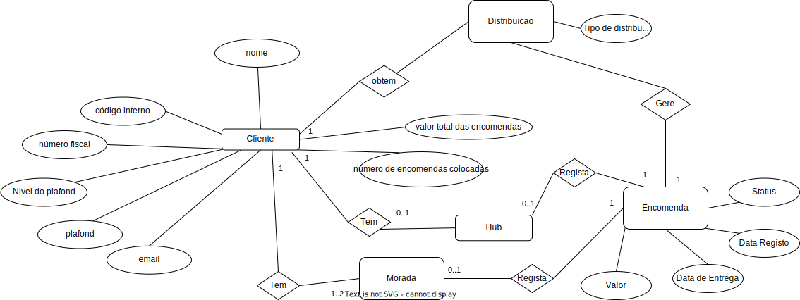

# US 215 - Como Gestor Agrícola, quero ter acesso à lista de hubs onde os meus clientes podem recolher os meus produtos previamente encomendados

## 1. Requerimentos

### 1.1. Descrição da User Story

Como Gestor Agrícola, quero ter acesso à lista de hubs onde os meus clientes podem
recolher os meus produtos previamente encomendados. Um cliente pode ter associado um hub por
defeito – o local onde regularmente recolhe os produtos adquiridos. No entanto, o ponto de recolha
(hub) pode ser alterado para cada encomenda. Posso também alterar o hub por defeito de um
cliente. A lista de hubs é atualizada sempre que necessário por intermédio da tabela
_**input_hub(input_string VARCHAR(25))**_ onde são introduzidos os registos com essa
informação, em formato csv, por um componente do meu sistema de informação externo ao módulo
de gestão da exploração.
Segue-se um exemplo do ficheiro csv que é carregado para a tabela **_input_hub_**:  

**Loc id;lat;lng;Clientes-Produtores  
CT1;40.6389;-8.6553;C1  
CT2;38.0333;-7.8833;C2  
CT14;38.5243;-8.8926;E1  
CT11;39.3167;-7.4167;E2  
CT10;39.7444;-8.8072;P3**

Quando este ficheiro é carregado na nossa base de dados, por um processo que não controlamos, a
tabela input_hub fica com os seguintes registos:

**CT1;40.6389;-8.6553;C1  
CT2;38.0333;-7.8833;C2  
CT14;38.5243;-8.8926;E1  
CT11;39.3167;-7.4167;E2  
CT10;39.7444;-8.8072;P3**

Este ficheiro tem informação sobre clientes e hubs. Os clientes têm um código no campo
Clientes-Produtores que começa com a letra C (os dois primeiros registos do exemplo
acima). Estes registos devem ser ignorados dado que não correspondem a hubs; os restantes registos
correspondem a hubs e devem ser persistidos na nossa base de dados numa tabela hub a incluir no
nosso esquema.


### 1.2. Clarificações e especificações do cliente

Nenhuma

### 1.3. Critérios de aceitação

* **CA1:** É possível executar um procedimento para atualizar a tabela hub a partir da tabela
   **_input_hub_** quando esta for atualizada. O código de um hub é o valor do campo **Loc id**
* **CA2:** É possível atribuir e alterar o hub por defeito de um cliente.
* **CA3:** Quando o cliente efetua uma nota de encomenda pode indicar um hub, distinto do seu hub por
   defeito, para proceder à recolha dos produtos encomendados. O hub indicado deve ser válido,
   i.e., deve existir na tabela hub.

### 1.4. Dependências

Nenhuma encontrada

### 1.5 Dados de Input e Output 

#### CA1
**Input:**
   * Nenhum

**Output:**
   * Quantidade de hubs criados
   * Sucesso da operação

#### CA2
**Input:**
   * Id do cliente
   * Loc id do hub

**Output:**

   * Sucesso da operação

#### CA3
**Input:**
* Id do cliente que quer receber a encomenda 
* Loc id do hub onde o cliente vai proceder á recolha da encomenda
* Valor da encomenda
* Id da plantação que corresponde à encomenda
* Id do gestor de distirbuição atribuído a essa encomenda 

**Output:**

* Sucesso da operação

### 1.7. Excerto relevante do modelo de domínio 



# 2. Implementação

* CA1

```
  CREATE OR REPLACE PROCEDURE prcCriarHubsComInputHub AS
  input_string varchar2(25);
  inserted_hubs number;
  counter number;
  loc_id_input varchar2(255);
  loc_id_end_indx number;
  latitude_input varchar2(255);
  latitude_end_indx number;
  longitude_input varchar2(255);
  longitude_end_indx number;
  cod varchar2(255);

cursor input_hubs IS
SELECT * FROM INPUTHUB;

BEGIN
inserted_hubs := 0;
OPEN input_hubs;
LOOP
   FETCH input_hubs INTO input_string;
   EXIT WHEN input_hubs%NOTFOUND;
   
   loc_id_end_indx := instr(input_string,';',1,1);
   latitude_end_indx := instr(input_string,';',1,2);
   longitude_end_indx := instr(input_string,';',1,3);
   cod := substr(input_string,longitude_end_indx+1,length(input_string)-longitude_end_indx);

   IF (substr(cod,1,1) LIKE 'E') THEN

      loc_id_input := substr(input_string,1,loc_id_end_indx-1);
   
      SELECT COUNT(*) INTO counter FROM HUB
      WHERE LOC_ID_PK LIKE loc_id_input;

      IF (counter = 0) THEN
         latitude_input := replace(substr(input_string,loc_id_end_indx+1,latitude_end_indx-loc_id_end_indx-1),'.',',');
           longitude_input := replace(substr(input_string,latitude_end_indx+1,longitude_end_indx-latitude_end_indx-1),'.',',');
            INSERT INTO HUB(loc_id_pk, latitude, longitude) VALUES (loc_id_input,CAST(latitude_input AS DOUBLE PRECISION),CAST(longitude_input AS DOUBLE PRECISION));
            inserted_hubs:=inserted_hubs+1;
      end if;
   END IF;
end loop;
IF (inserted_hubs = 0) THEN
   DBMS_OUTPUT.PUT_LINE('Nenhum hub foi inserido. (Pode estar a inserir dados repetidos ou inválidos ou a tabela inputHubs pode estar vazia)');
ELSE
   DBMS_OUTPUT.PUT_LINE('Tabela atulizada. Foram inserido(s) ' || inserted_hubs || ' hub(s).');
END IF;

DELETE FROM INPUTHUB;
end;
```


* CA2

```
CREATE OR REPLACE PROCEDURE prcAtualizarHubDeCliente(id_cliente CLIENTE.ID_UTILIZADOR_CLIENTE_FK%TYPE,
                                                     id_hub HUB.loc_id_pk%TYPE) AS
    client_counter number;
    hub_counter number;
    invalid_client_id EXCEPTION;
    invalid_hub_id EXCEPTION;
BEGIN
SELECT COUNT(*) INTO client_counter FROM CLIENTE
WHERE ID_UTILIZADOR_CLIENTE_FK = id_cliente;
SELECT COUNT(*) INTO hub_counter FROM HUB
WHERE LOC_ID_PK = id_hub;
IF (client_counter = 0) THEN
        RAISE invalid_client_id;
END IF;
    IF (hub_counter = 0) THEN
        RAISE invalid_hub_id;
END IF;

UPDATE CLIENTE SET HUB_LOC_ID_FK = id_hub
WHERE ID_UTILIZADOR_CLIENTE_FK = id_cliente;
DBMS_OUTPUT.PUT_LINE('Hub do cliente atualizado com sucesso.');
EXCEPTION
    WHEN invalid_client_id THEN
        DBMS_OUTPUT.PUT_LINE('Não existe um cliente com este id.');
WHEN invalid_hub_id THEN
        DBMS_OUTPUT.PUT_LINE('Não existe um hub com este id.');
END;
```
* CA3

```
CREATE OR REPLACE PROCEDURE prcRegistarPedidoAEntregarEmHub(id_cliente IN DISTRIBUICAO.ID_UTILIZADOR_CLIENTE_FK%TYPE,
                                                            id_plantacao IN DISTRIBUICAO.ID_PLANTACAO_FK%TYPE,
                                                            id_gestor_distribuicao IN DISTRIBUICAO.ID_UTILIZADOR_GESTOR_DISTRIBUICAO_FK%TYPE,
                                                            param_id_hub_entrega HUB.loc_id_pk%TYPE,
                                                            valor ENCOMENDA.valor%TYPE) AS

    valor_encomendas_total CLIENTE.VALOR_ENCOMENDAS%TYPE;
    plafond_cliente CLIENTE.PLAFOND%TYPE;
    id_distribuicao DISTRIBUICAO.ID_DISTRIBUICAO_PK%TYPE;
    id_hub_entrega HUB.loc_id_pk%TYPE := param_id_hub_entrega;

    contador_hubs NUMBER;
    contador_cliente NUMBER;
    contador_gestor_dist NUMBER;
    contador_plantacao NUMBER;

    e_limite_plafond_atingido EXCEPTION;
    nenhum_hub_para_associar EXCEPTION;
    hub_invalido EXCEPTION;
    cliente_invalido EXCEPTION;
    plantacao_invalida EXCEPTION;
    gestor_dist_invalido EXCEPTION;
    valor_invalido EXCEPTION;
BEGIN

SELECT COUNT(*) INTO contador_cliente FROM CLIENTE
WHERE ID_UTILIZADOR_CLIENTE_FK = id_cliente;
IF (contador_cliente = 0) THEN
        -- Se não existir
        RAISE cliente_invalido;
END IF;

SELECT COUNT(*) INTO contador_plantacao FROM PLANTACAO
WHERE ID_PLANTACAO_PK = id_plantacao;
IF (contador_plantacao = 0) THEN
        -- Se não existir
        RAISE plantacao_invalida;
END IF;

SELECT COUNT(*) INTO contador_gestor_dist FROM GESTORDISTRIBUICAO
WHERE ID_UTILIZADOR_GESTOR_DISTRIBUICAO_FK = id_gestor_distribuicao;
IF (contador_gestor_dist = 0) THEN
        -- Se não existir
        RAISE gestor_dist_invalido;
END IF;

IF(valor <= 0) THEN
        RAISE valor_invalido ;
END IF;

--Check para ver se foi passado um hub por parâmetro
IF id_hub_entrega IS NULL THEN
   -- Se não, vamos buscar o hub default associado ao cliente
   -- Se não existir hub default (o select não retorna nada) -> exceção NO_DATA_FOUND
   SELECT HUB_LOC_ID_FK INTO id_hub_entrega
   FROM CLIENTE
   INNER JOIN HUB ON HUB.LOC_ID_PK = CLIENTE.HUB_LOC_ID_FK
   WHERE CLIENTE.ID_UTILIZADOR_CLIENTE_FK = id_cliente;
ELSE
        -- Se sim, vamos ver se existe
   SELECT COUNT(*) INTO contador_hubs FROM HUB
   WHERE LOC_ID_PK = id_hub_entrega;
   IF (contador_hubs = 0) THEN
               -- Se não existir
               RAISE hub_invalido;
   END IF;
END IF;

SELECT CLIENTE.VALOR_ENCOMENDAS INTO valor_encomendas_total FROM CLIENTE
WHERE CLIENTE.ID_UTILIZADOR_CLIENTE_FK = id_cliente;

SELECT CLIENTE.PLAFOND INTO plafond_cliente FROM CLIENTE
WHERE CLIENTE.ID_UTILIZADOR_CLIENTE_FK = id_cliente;

IF valor_encomendas_total + valor >= plafond_cliente THEN
        RAISE e_limite_plafond_atingido;
END IF;

INSERT INTO DISTRIBUICAO(ID_DISTRIBUICAO_PK,
                         ID_PLANTACAO_FK, ID_UTILIZADOR_CLIENTE_FK,
                         ID_UTILIZADOR_GESTOR_DISTRIBUICAO_FK,
                         TIPO_DISTRIBUICAO) VALUES (DEFAULT, id_plantacao,id_cliente, id_gestor_distribuicao, 'ENCOMENDA') RETURNING ID_DISTRIBUICAO_PK INTO id_distribuicao ;

INSERT INTO ENCOMENDA(ID_DISTRIBUICAO_FK, ID_MORADA_ENTREGA_FK,HUB_LOC_ID_FK, DATA_ENTREGA, DATA_REGISTO, STATUS, VALOR)
VALUES (id_distribuicao, NULL, id_hub_entrega ,NULL, SYSDATE, 'REGISTADA', valor);
dbms_output.put_line('Encomenda registada com sucesso.');

EXCEPTION
    WHEN cliente_invalido THEN
        dbms_output.put_line('Não existe um cliente com este id.');

WHEN plantacao_invalida THEN
        dbms_output.put_line('Não existe uma plantação com este id.');

WHEN gestor_dist_invalido THEN
        dbms_output.put_line('Não existe um gestor de distribuição com este id.');

WHEN valor_invalido THEN
        dbms_output.put_line('O valor da encomenda tem de ser um valor positivo.');

WHEN hub_invalido THEN
        dbms_output.put_line('Não existe um hub com este id.');

WHEN NO_DATA_FOUND THEN
        dbms_output.put_line('Este cliente não têm um hub associado. É necessário associar um hub ao cliente ou fornecer um id de hub para realizar esta operação.');

WHEN e_limite_plafond_atingido THEN
        dbms_output.put_line('É necessário pagar algumas encomendas pendentes para prosseguir, porque já ultrapassou o seu plafond');
END;
```