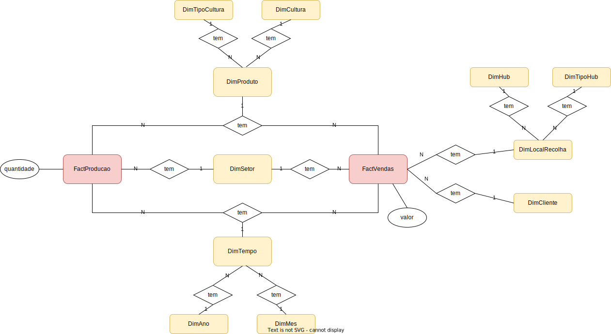

# US 216 - Como Gestor Agrícola, pretendo incluir no meu sistema de análise de produção e vendas, também a dimensão local de recolha (hub).

## 1. Requerimentos

### 1.1. Descrição da User Story

  Como Gestor Agrícola, pretendo incluir no meu sistema de análise de produção e vendas,
também a dimensão local de recolha (hub). Esta dimensão tem uma hierarquia de agregação com
dois níveis: tipo de hub, hub. O tipo de hub é dado pela letra do seu código ClientesProdutores.


### 1.2. Clarificações e especificações do cliente
* Pergunta:
  A Data Warehouse a desenvolver nesta US tem de estar ligada à Data Base principal?
  Ou seja, os inserts/updates/deletes da Data Base principal afetam os dados existentes na Data Warehouse?
  - Resposta :
    Podem gerar as tabelas para o datawarehouse (dw) no schema da bd operacional.
    Não é suposto implementarem os mecanismos de sincronismo entre a bd operacional e o dw; daí a necessidade de criar o script que faça o bootstrap do dw


### 1.3. Critérios de aceitação

* **CA1:** Foi adicionada a tabela para a nova dimensão e está devidamente estruturada.
* **CA2:** As tabelas de factos integram corretamente a dimensão Local de recolha.
* **CA3:**  Um script SQL para carregar o esquema Star/Snowflake com dados suficientes para suportar
  uma prova de conceito está disponível e é executado sem erros.
* **CA4:** Um script SQL para consultar o data warehouse e suportar uma prova de conceito está
  disponível e é executado sem erros. Este script responde as seguintes perguntas:
  - a) Analisar a evolução das vendas mensais por tipo de cultura e hub?


### 1.4. Dependências

* Depende funcionalmente da US214, visto que esta user story apenas requer que adicionemos dimensões à DataWarehouse.

### 1.5 Dados de Input e Output 

#### CA4 a)
**Input:**
* Mês da data1
* Ano da data1
* Mês da data2
* Ano da data2
* Id do hub
* Id do tipo de cultura

**Output:**
* A evolução de vendas mensais entre os intervalos de tempo inseridos.

### 1.7. Excerto relevante do modelo de domínio 



# 2. Implementação

* CA4 a)

```
CREATE OR REPLACE PROCEDURE prcVendasMensaisTipoCulturaHub(mes_inicial DIMMES.ID_DIM_MES_PK%TYPE,
                                                           ano_inicial DIMANO.ID_DIM_ANO_PK%TYPE,
                                                           mes_final DIMMES.ID_DIM_MES_PK%TYPE,
                                                           ano_final DIMANO.ID_DIM_ANO_PK%TYPE,
                                                           hub DIMHUB.ID_DIM_HUB_PK%TYPE,
                                                           tipo_cultura DIMTIPOCULTURA.ID_DIM_TIPO_CULTURA_PK%TYPE) AS
    ano DIMANO.ID_DIM_ANO_PK%TYPE;
    mes DIMMES.ID_DIM_MES_PK%TYPE;
    ano_anterior DIMANO.ID_DIM_ANO_PK%TYPE;
    mes_anterior DIMMES.ID_DIM_MES_PK%TYPE;
    dim_tempo_pk DIMTEMPO.ID_DIM_TEMPO_PK%TYPE;
    count_vendas_mes_anterior number;
    count_vendas_mes number;
    sum_valor_mes_anterior number;
    sum_valor_mes number;
    dif_valor number;
    count_tempo number;
    e_data_final_maior_inicial EXCEPTION;
    e_data_maior_atual EXCEPTION;
    e_datas_iguais EXCEPTION;
    this_year varchar(255);
    this_year_number number;
    this_month varchar(255);
    this_month_number number;

BEGIN
        -- get the current date
    SELECT to_char(sysdate, 'YYYY') INTO this_year FROM DUAL;
    this_year_number := CAST(this_year AS NUMBER);
    SELECT to_char(sysdate, 'MM') INTO this_month FROM DUAL;
    this_month_number := CAST(this_month AS NUMBER);

        -- checks of the current date
    IF this_year_number < ano_final OR this_year_number < ano_inicial THEN
        RAISE e_data_maior_atual;
    END IF;

    IF this_month_number < mes_inicial AND this_year_number < ano_inicial THEN
        RAISE e_data_maior_atual;
    END IF;

    IF this_month_number < mes_final AND this_year_number < ano_final THEN
        RAISE e_data_maior_atual;
    END IF;

         -- checks for incoherent dates
    IF ano_final < ano_inicial THEN
        RAISE e_data_final_maior_inicial;
    END IF;
    IF mes_final < mes_inicial AND ano_final = ano_inicial THEN
        RAISE e_data_final_maior_inicial;
    END IF;
    IF mes_final = mes_inicial AND ano_final = ano_inicial THEN
        RAISE e_datas_iguais;
    END IF;

    ano := ano_inicial;
    mes := mes_inicial;

    LOOP
        EXIT WHEN ano = ano_final AND mes = mes_final;
        ano_anterior := ano;
        mes_anterior := mes;
        IF mes = 12 THEN
            mes:= 1;
            ano:= ano + 1;
        ELSE
            mes:= mes + 1;
        END IF;
        -- ANTERIOR

        -- COUNT TEMPORAL

    SELECT COUNT(DIMTEMPO.ID_DIM_TEMPO_PK) INTO count_tempo FROM DIMTEMPO
    WHERE DIMTEMPO.ID_DIM_ANO_FK = ano_anterior AND DIMTEMPO.ID_DIM_MES_FK = mes_anterior;

    IF count_tempo != 0 THEN
                -- PK TEMPORAL
        SELECT DIMTEMPO.ID_DIM_TEMPO_PK INTO dim_tempo_pk FROM DIMTEMPO
        WHERE DIMTEMPO.ID_DIM_ANO_FK = ano_anterior AND DIMTEMPO.ID_DIM_MES_FK = mes_anterior;

        -- SUM MES
        SELECT SUM(FACTVENDAS.VALOR) INTO sum_valor_mes_anterior FROM FACTVENDAS
                                                                          INNER JOIN DIMTEMPO ON FACTVENDAS.ID_DIM_TEMPO_FK = DIMTEMPO.ID_DIM_TEMPO_PK
                                                                          INNER JOIN DIMANO ON DIMTEMPO.ID_DIM_ANO_FK = DIMANO.ID_DIM_ANO_PK
                                                                          INNER JOIN DIMPRODUTO ON FACTVENDAS.ID_DIM_PRODUTO_FK = DIMPRODUTO.ID_DIM_PRODUTO_PK
                                                                          INNER JOIN DIMLOCALRECOLHA ON FACTVENDAS.ID_DIM_LOCAL_RECOLHA_FK = DIMLOCALRECOLHA.ID_DIM_LOCAL_RECOLHA_PK
        WHERE DIMTEMPO.ID_DIM_TEMPO_PK = dim_tempo_pk
          AND DIMPRODUTO.ID_DIM_TIPO_CULTURA_FK = tipo_cultura
          AND DIMLOCALRECOLHA.ID_DIM_HUB_FK = hub;
        -- COUNT MES
        SELECT COUNT(FACTVENDAS.ID_FACT_VENDAS_PK) INTO count_vendas_mes_anterior FROM FACTVENDAS
                                                                                           INNER JOIN DIMTEMPO ON FACTVENDAS.ID_DIM_TEMPO_FK = DIMTEMPO.ID_DIM_TEMPO_PK
                                                                                           INNER JOIN DIMANO ON DIMTEMPO.ID_DIM_ANO_FK = DIMANO.ID_DIM_ANO_PK
                                                                                           INNER JOIN DIMPRODUTO ON FACTVENDAS.ID_DIM_PRODUTO_FK = DIMPRODUTO.ID_DIM_PRODUTO_PK
                                                                                           INNER JOIN DIMLOCALRECOLHA ON FACTVENDAS.ID_DIM_LOCAL_RECOLHA_FK = DIMLOCALRECOLHA.ID_DIM_LOCAL_RECOLHA_PK
        WHERE DIMTEMPO.ID_DIM_TEMPO_PK = dim_tempo_pk
          AND DIMPRODUTO.ID_DIM_TIPO_CULTURA_FK = tipo_cultura
          AND DIMLOCALRECOLHA.ID_DIM_HUB_FK = hub;
    ELSE
                    count_vendas_mes_anterior := 0;
    END IF;
            --...........................................................................................................................................
    --  POSTERIOR
            -- COUNT TEMPORAL
    SELECT COUNT(DIMTEMPO.ID_DIM_TEMPO_PK) INTO count_tempo FROM DIMTEMPO
    WHERE DIMTEMPO.ID_DIM_ANO_FK = ano AND DIMTEMPO.ID_DIM_MES_FK = mes;

    IF count_tempo != 0 THEN
                -- PK TEMPORAL
        SELECT DIMTEMPO.ID_DIM_TEMPO_PK INTO dim_tempo_pk FROM DIMTEMPO
        WHERE DIMTEMPO.ID_DIM_ANO_FK = ano AND DIMTEMPO.ID_DIM_MES_FK = mes;

        -- SUM MES
        SELECT SUM(FACTVENDAS.VALOR) INTO sum_valor_mes FROM FACTVENDAS
                                                                 INNER JOIN DIMTEMPO ON FACTVENDAS.ID_DIM_TEMPO_FK = DIMTEMPO.ID_DIM_TEMPO_PK
                                                                 INNER JOIN DIMANO ON DIMTEMPO.ID_DIM_ANO_FK = DIMANO.ID_DIM_ANO_PK
                                                                 INNER JOIN DIMPRODUTO ON FACTVENDAS.ID_DIM_PRODUTO_FK = DIMPRODUTO.ID_DIM_PRODUTO_PK
                                                                 INNER JOIN DIMLOCALRECOLHA ON FACTVENDAS.ID_DIM_LOCAL_RECOLHA_FK = DIMLOCALRECOLHA.ID_DIM_LOCAL_RECOLHA_PK
        WHERE DIMTEMPO.ID_DIM_TEMPO_PK = dim_tempo_pk
          AND DIMPRODUTO.ID_DIM_TIPO_CULTURA_FK = tipo_cultura
          AND DIMLOCALRECOLHA.ID_DIM_HUB_FK = hub;
        -- COUNT MES
        SELECT COUNT(FACTVENDAS.ID_FACT_VENDAS_PK) INTO count_vendas_mes FROM FACTVENDAS
                                                                                  INNER JOIN DIMTEMPO ON FACTVENDAS.ID_DIM_TEMPO_FK = DIMTEMPO.ID_DIM_TEMPO_PK
                                                                                  INNER JOIN DIMANO ON DIMTEMPO.ID_DIM_ANO_FK = DIMANO.ID_DIM_ANO_PK
                                                                                  INNER JOIN DIMPRODUTO ON FACTVENDAS.ID_DIM_PRODUTO_FK = DIMPRODUTO.ID_DIM_PRODUTO_PK
                                                                                  INNER JOIN DIMLOCALRECOLHA ON FACTVENDAS.ID_DIM_LOCAL_RECOLHA_FK = DIMLOCALRECOLHA.ID_DIM_LOCAL_RECOLHA_PK
        WHERE DIMTEMPO.ID_DIM_TEMPO_PK = dim_tempo_pk
          AND DIMPRODUTO.ID_DIM_TIPO_CULTURA_FK = tipo_cultura
          AND DIMLOCALRECOLHA.ID_DIM_HUB_FK = hub;
    ELSE
        count_vendas_mes := 0;
    END IF;
            --..............................................................................................................................................

    -- SE NÃO EXISTIREM VENDAS

    IF count_vendas_mes_anterior = 0 THEN
        sum_valor_mes_anterior := 0;
    END IF;

    IF count_vendas_mes = 0 THEN
        sum_valor_mes := 0;
    END IF;

    -- DIFERENÇA DE VALORES
    dif_valor := sum_valor_mes - sum_valor_mes_anterior;

    -- PRINT
    IF dif_valor < 0 THEN
        DBMS_OUTPUT.PUT_LINE('Em '|| mes || '/'|| ano|| ' foram vendidos ' || dif_valor || '€ do que em ' || mes_anterior || '/' || ano_anterior);
    ELSE
        IF dif_valor = 0 THEN
            DBMS_OUTPUT.PUT_LINE('Foi vendido o mesmo valor em ' || mes_anterior || '/' || ano_anterior || ' e ' || mes || '/'|| ano);
        ELSE
            DBMS_OUTPUT.PUT_LINE('Em '|| mes || '/'|| ano|| ' foram vendidos +' || dif_valor || '€ do que em ' || mes_anterior || '/' || ano_anterior);
        END IF;
    END IF;
END LOOP;
EXCEPTION
    WHEN e_data_final_maior_inicial THEN
        dbms_output.put_line('Erro: A data final inserida é inferior à data inicial.');
    WHEN e_data_maior_atual THEN
        dbms_output.put_line('Erro: Pelo menos uma das datas inseridas é superior à atual.');
    WHEN e_datas_iguais THEN
        dbms_output.put_line('Erro: As datas que inseriu são as mesmas.');
END;

```