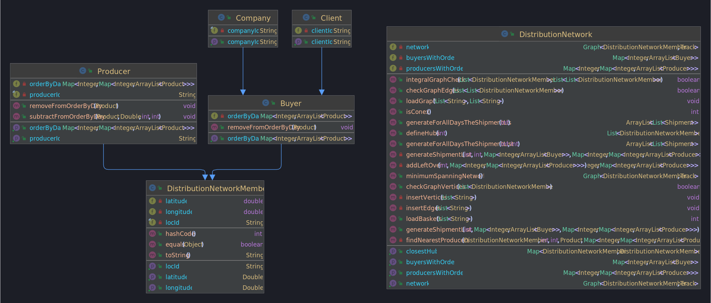

# US 307

## 1. Requerimentos

### 1.1. Descrição da User Story

*Importar a lista de cabazes.*

### 1.2 Dados de Input e Output
**Input:**
* Caminho do ficheiro de cabazes

**Output:**
* Resposta com o sucesso ou insucesso da operação

## 2 Class Diagram (CD)

# 3. Testes

**Teste 1:** Teste que verifica se os cabazes estão a ser inseridos de acordo com os ficheiros 

    @Test
    public void loadBaskets() throws IOException {
        DistributionNetwork distributionNetwork = new DistributionNetwork();
        List<String> memberInfoSmall = Files.lines(Paths.get("Files/Small/clientes-produtores_small.csv"), StandardCharsets.ISO_8859_1).collect(Collectors.toList());
        List<String> trackInfoSmall = Files.lines(Paths.get("Files/Small/distancias_small.csv"), StandardCharsets.ISO_8859_1).collect(Collectors.toList());
        List<String> basketsInfo = Files.lines(Paths.get("Files/TestUS307/cabazes_US307.csv"), StandardCharsets.ISO_8859_1).collect(Collectors.toList());
        distributionNetwork.loadGraph(memberInfoSmall, trackInfoSmall);
        distributionNetwork.loadBaskets(basketsInfo);

        //ORDER BY DAY OF C1
        Map<Integer, ArrayList<Product>> expectedC1 = new HashMap<>();
        Buyer buyer = (Buyer) distributionNetwork.getNetwork().vertex(0);
        assertEquals(expectedC1, buyer.getOrderByDay());

        //ORDER BY DAY OF P3
        Map<Integer, Map<Integer, ArrayList<Product>>> expectedP3 = new HashMap<>();
        ArrayList<Product> products = new ArrayList<>();
        expectedP3.put(2, new HashMap<>());
        expectedP3.get(2).put(1, new ArrayList<>());
        expectedP3.get(2).get(1).add(new Product(1, 1.0));
        expectedP3.get(2).put(2, new ArrayList<>());
        expectedP3.get(2).get(2).add(new Product(2, 1.0));
        Producer producer = (Producer) distributionNetwork.getNetwork().vertex(16);
        assertEquals(expectedP3, producer.getOrderByDay());

        //ORDER BY DAY OF E4
        Map<Integer, ArrayList<Product>> expectedE4 = new HashMap<>();
        products = new ArrayList<>();
        products.add(new Product(2, 2.0));
        products.add(new Product(3, 4.0));
        expectedE4.put(1, products);
        buyer = (Buyer) distributionNetwork.getNetwork().vertex(12);
        assertEquals(expectedE4, buyer.getOrderByDay());

        //ORDER BY DAY OF C3
        Map<Integer, ArrayList<Product>> expectedC3 = new HashMap<>();
        products = new ArrayList<>();
        products.add(new Product(1, 5.0));
        products.add(new Product(2, 2.0));
        products.add(new Product(3, 9.0));
        expectedC3.put(1, products);
        buyer = (Buyer) distributionNetwork.getNetwork().vertex(2);
        assertEquals(expectedC3, buyer.getOrderByDay());

        // CHECK BUYERS LIST
        Map<Integer, ArrayList<Buyer>> buyersList = new HashMap<>();
        buyersList.put(1, new ArrayList<>());
        buyersList.get(1).add((Buyer) distributionNetwork.getNetwork().vertex(12));
        buyersList.get(1).add((Buyer) distributionNetwork.getNetwork().vertex(2));

        // CHECK PRODUCERS LIST
        Map<Integer, Map<Integer, ArrayList<Producer>>> producersList = new HashMap<>();
        producersList.put(2, new HashMap<>());
        producersList.get(2).put(1, new ArrayList<>());
        producersList.get(2).put(2, new ArrayList<>());
        producersList.get(2).get(1).add((Producer) distributionNetwork.getNetwork().vertex(16));
        producersList.get(2).get(2).add((Producer) distributionNetwork.getNetwork().vertex(16));
        assertEquals(buyersList, distributionNetwork.getBuyersWithOrders());
        assertEquals(producersList, distributionNetwork.getProducersWithOrders());
    }

**Teste 2:** Teste que verifica a inserção de cabazes com um ficheiro que não tem cabazes com membros existentes

    @Test
    public void loadBasketsOfUnexistingMembers() throws IOException {
        DistributionNetwork distributionNetwork = new DistributionNetwork();
        List<String> memberInfoSmall = Files.lines(Paths.get("Files/Small/clientes-produtores_small.csv"), StandardCharsets.ISO_8859_1).collect(Collectors.toList());
        List<String> trackInfoSmall = Files.lines(Paths.get("Files/Small/distancias_small.csv"), StandardCharsets.ISO_8859_1).collect(Collectors.toList());
        List<String> basketsInfo = Files.lines(Paths.get("Files/TestUS307/cabazes_membros_inexistentes.csv"), StandardCharsets.ISO_8859_1).collect(Collectors.toList());
        distributionNetwork.loadGraph(memberInfoSmall, trackInfoSmall);

        // CHECK THAT 0 OF 2 DAYS HAVE BEEN READ SUCCESSFULLY
        int expected = 0;
        assertEquals(expected, distributionNetwork.loadBaskets(basketsInfo));
    }

**Teste 3:** Teste que verifica se cabazes com membros que não existem no grafo não são inseridos

    @Test
    public void loadBasketsWithSomeUnexistingMembers() throws IOException {
        DistributionNetwork distributionNetwork = new DistributionNetwork();
        List<String> memberInfoSmall = Files.lines(Paths.get("Files/Small/clientes-produtores_small.csv"), StandardCharsets.ISO_8859_1).collect(Collectors.toList());
        List<String> trackInfoSmall = Files.lines(Paths.get("Files/Small/distancias_small.csv"), StandardCharsets.ISO_8859_1).collect(Collectors.toList());
        List<String> basketsInfo = Files.lines(Paths.get("Files/TestUS307/cabazes_US307_com_membros_inexistentes.csv"), StandardCharsets.ISO_8859_1).collect(Collectors.toList());
        distributionNetwork.loadGraph(memberInfoSmall, trackInfoSmall);

        // CHECK THAT 4 OF 6 DAYS HAVE BEEN READ SUCCESSFULLY
        int expected = 4;
        assertEquals(expected, distributionNetwork.loadBaskets(basketsInfo));

        //ORDER BY DAY OF C1
        Map<Integer, ArrayList<Product>> expectedC1 = new HashMap<>();
        Buyer buyer = (Buyer) distributionNetwork.getNetwork().vertex(0);
        assertEquals(expectedC1, buyer.getOrderByDay());

        //ORDER BY DAY OF P3
        Map<Integer, Map<Integer, ArrayList<Product>>> expectedP3 = new HashMap<>();
        ArrayList<Product> products = new ArrayList<>();
        expectedP3.put(2, new HashMap<>());
        expectedP3.get(2).put(1, new ArrayList<>());
        expectedP3.get(2).get(1).add(new Product(1, 1.0));
        expectedP3.get(2).put(2, new ArrayList<>());
        expectedP3.get(2).get(2).add(new Product(2, 1.0));
        Producer producer = (Producer) distributionNetwork.getNetwork().vertex(16);
        assertEquals(expectedP3, producer.getOrderByDay());

        //ORDER BY DAY OF E4
        Map<Integer, ArrayList<Product>> expectedE4 = new HashMap<>();
        products = new ArrayList<>();
        products.add(new Product(2, 2.0));
        products.add(new Product(3, 4.0));
        expectedE4.put(1, products);
        buyer = (Buyer) distributionNetwork.getNetwork().vertex(12);
        assertEquals(expectedE4, buyer.getOrderByDay());

        //ORDER BY DAY OF C3
        Map<Integer, ArrayList<Product>> expectedC3 = new HashMap<>();
        products = new ArrayList<>();
        products.add(new Product(1, 5.0));
        products.add(new Product(2, 2.0));
        products.add(new Product(3, 9.0));
        expectedC3.put(1, products);
        buyer = (Buyer) distributionNetwork.getNetwork().vertex(2);
        assertEquals(expectedC3, buyer.getOrderByDay());

        // CHECK BUYERS LIST
        Map<Integer, ArrayList<Buyer>> buyersList = new HashMap<>();
        buyersList.put(1, new ArrayList<>());
        buyersList.get(1).add((Buyer) distributionNetwork.getNetwork().vertex(12));
        buyersList.get(1).add((Buyer) distributionNetwork.getNetwork().vertex(2));

        // CHECK PRODUCERS LIST
        Map<Integer, Map<Integer, ArrayList<Producer>>> producersList = new HashMap<>();
        producersList.put(2, new HashMap<>());
        producersList.get(2).put(1, new ArrayList<>());
        producersList.get(2).put(2, new ArrayList<>());
        producersList.get(2).get(1).add((Producer) distributionNetwork.getNetwork().vertex(16));
        producersList.get(2).get(2).add((Producer) distributionNetwork.getNetwork().vertex(16));
        assertEquals(buyersList, distributionNetwork.getBuyersWithOrders());
        assertEquals(producersList, distributionNetwork.getProducersWithOrders());
    }

# 4. Implementação

    public int loadBaskets(List<String> basketsInfo) {
        int successfulLines = 0;
        ArrayList<Product> listProduct;
        for (String s : basketsInfo) {
            String[] values = s.split(",");
            if (s.charAt(2) != 'l' & s.charAt(1) != 'l') {
                if (values[0].charAt(0) == '"') {
                    values[0] = values[0].replace("\"", "");
                }
                int day = Integer.parseInt(values[1]);
                try {
                    int vKey = keyMemberId.get(values[0]); // obter a key do vértice através do Loc id
                    listProduct = new ArrayList<>();
                    for (int i = 2; i < values.length; i++) {
                        if (Double.parseDouble(values[i]) != 0) {
                            //inserção de cabazes se forem produtores
                            if (values[0].charAt(0) == 'P') {
                                // inserção no producersWithOrders------------------------------------------------------
                                //check se já existe o dia no map
                                if (!producersWithOrders.containsKey(day)) {
                                    producersWithOrders.put(day, new HashMap<>());
                                }
                                //check se já existe o tipo de produto nesse dia
                                if (!producersWithOrders.get(day).containsKey(i - 1)) {
                                    producersWithOrders.get(day).put(i - 1, new ArrayList<>());
                                }
                                producersWithOrders.get(day).get(i - 1).add((Producer) network.vertex(vKey));
                                Producer producer = (Producer) network.vertex(vKey);
                                // inserção no getOrderByDay do produtor------------------------------------------------------
                                //check se já existe o dia no map
                                if (!producer.getOrderByDay().containsKey(day)) {
                                    producer.getOrderByDay().put(day, new HashMap<>());
                                }
                                //adicionar o produto ao getOrderByDay
                                producer.getOrderByDay().get(day).put(i - 1, new ArrayList<>());
                                producer.getOrderByDay().get(day).get(i - 1).add(new Product(i - 1, Double.parseDouble(values[i])));
                            }
                            listProduct.add(new Product(i - 1, Double.parseDouble(values[i])));
                        }
                    }
                    //inserção de cabazes se forem compradores
                    if (values[0].charAt(0) != 'P' && !listProduct.isEmpty()) {
                        // inserção em buyersWithOrders------------------------------------------------------
                        if (!buyersWithOrders.containsKey(day)) {
                            buyersWithOrders.put(day, new ArrayList<>());
                        }
                        buyersWithOrders.get(day).add((Buyer) network.vertex(vKey));
                        // inserção no getOrderByDay do comprador------------------------------------------------------
                        Buyer buyer = (Buyer) network.vertex(vKey);
                        buyer.getOrderByDay().put(day, listProduct);
                    }
                    successfulLines++;
                } catch (NullPointerException ignored) {
                }
            }
        }
        return successfulLines;
    }
