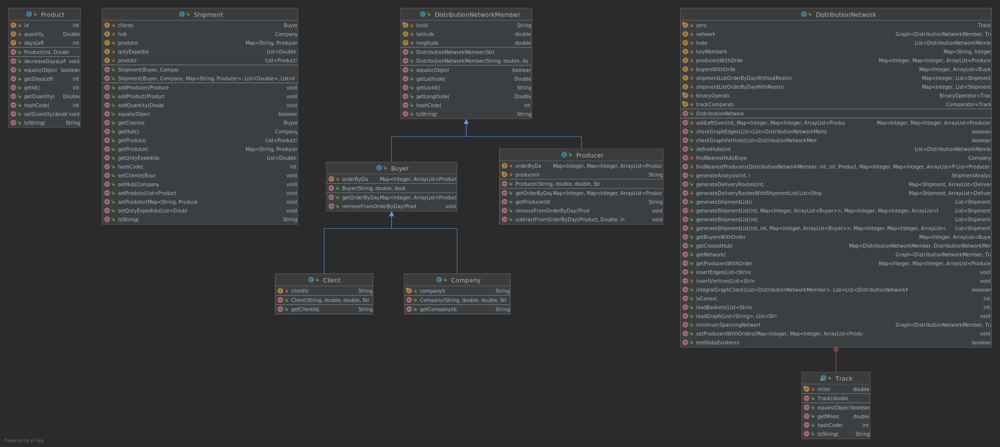

# US308 - Gerar uma lista de expedição para um determinado dia que forneça os cabazes semqualquer restrição quanto aos produtores.

## 1. Requerimentos

### 1.1. Descrição da User Story
Gerar uma lista de expedição para um determinado dia que forneça os cabazes sem
qualquer restrição quanto aos produtores.

### 1.2. Clarificações e especificações do cliente
N/A

### 1.3. Critérios de aceitação
**CA1**: Os produtos que sobram devem ser adicionados ao próximo dia

**CA2**: Os produtos têm 3 dias de validade, podendo no máximo transitar para os próximos 2 dias

### 1.4. Dependências
* US307

### 1.5 Dados de Input e Output
**Input:**
* Dia 

**Output:**
* Lista de expedição

## 2 Class Diagram (CD)


# 3. Testes

**Teste 1:** 

```
@Test
    public void generateShipmentListUS308_1() {
        distributionNetworkUS308.defineHubs(1);
        List<Shipment> actual = distributionNetworkUS308.generateShipmentList(1);
        List<Shipment> expected = new ArrayList<>();
        Client c1 = new Client("CT1",0.0,0.0,"C");
        Client c2 = new Client("CT2",0.0,0.0,"C");
        Company closestHub = new Company("CT3",0.0,0.0,"E");
        Producer p1 = new Producer("CT4",0.0,0.0,"P");
        Double q1 = 1.0;
        Double q2 = 2.0;
        Double q3 = 5.5;
        Double q4 = 4.5;
        Product prod1 = new Product(1,0.0);
        Product prod2 = new Product(2,0.0);
        Product prod3 = new Product(3,0.0);
        Shipment s1 = new Shipment(c1,closestHub);
        s1.addProducer(p1);
        s1.addQuantity(q1);
        s1.addQuantity(q2);
        s1.addProduct(prod1);
        s1.addProduct(prod2);
        Shipment s2 = new Shipment(c2,closestHub);
        s2.addProducer(p1);
        s2.addQuantity(q1);
        s2.addQuantity(q3);
        s2.addQuantity(q4);
        s2.addProduct(prod1);
        s2.addProduct(prod2);
        s2.addProduct(prod3);
        expected.add(s1);
        expected.add(s2);
        assertEquals(expected, actual);
    }

```
 


# 4. Implementação

```
     public List<Shipment> generateShipmentList(int day) {

        if(!producersWithOrders.containsKey(day)) return null;

        Map<Integer, Map<Integer, ArrayList<Producer>>> producersWithOrders = new HashMap<>(this.producersWithOrders);
        Map<Integer, ArrayList<Buyer>> buyersWithOrders = new HashMap<>(this.buyersWithOrders);

        for (int i = 1; i < day; i++) {
            generateShipmentList(i,buyersWithOrders,producersWithOrders);
            if(addLeftOver(i,producersWithOrders)!=null)producersWithOrders = addLeftOver(i,producersWithOrders);
        }
        return generateShipmentList(day,buyersWithOrders,producersWithOrders);

    }
    
    private List<Shipment> generateShipmentList(int day, Map<Integer, ArrayList<Buyer>> buyersWithOrders,
                                               Map<Integer, Map<Integer, ArrayList<Producer>>> producersWithOrders) {

            List<Shipment> shipmentList = new ArrayList<>();
            Company closestHub;
            for (Buyer client : buyersWithOrders.get(day)) {
                closestHub = findNearestHub(client);
                Shipment s = new Shipment(client, closestHub);
                shipmentList.add(s);
                ArrayList<Product> clientOrder = client.getOrderByDay().get(day);
                boolean found = false;
                for (Product clientProduct : clientOrder) {
                    if (found) {
                        found = false;
                    }
                    ArrayList<Producer> producers = producersWithOrders.get(day).get(clientProduct.getId());
                    if (producers != null) {
                        for (Producer producer : producersWithOrders.get(day).get(clientProduct.getId())) {
                            if (found) continue;
                            ArrayList<Product> producerProduction = new ArrayList<>();
                            try {
                                producerProduction = producer.getOrderByDay().get(day).get(clientProduct.getId());
                            }catch (Exception e){
                            }
                            if(producerProduction!=null) {
                                for (int j = producerProduction.size() - 1; j >= 0; j--) {
                                    if (found) continue;
                                    Product producerProduct = producerProduction.get(j);
                                    if (producerProduct != null) {
                                        if (producerProduct.getQuantity() >= clientProduct.getQuantity()) {
                                            s.addProducer(producer);
                                            s.addQuantity(clientProduct.getQuantity());
                                            s.addProduct(clientProduct);
                                            found = true;
                                            producer.subtractFromOrderByDay(producerProduct, clientProduct.getQuantity(), day, j);
                                        }
                                    }
                                }
                            }
                        }
                    }

                }
            }
            shipmentListOrderByDayWithoutRestrictions.put(day,shipmentList);

        return shipmentList;
    }
    
        public Map<Integer, Map<Integer, ArrayList<Producer>>> addLeftOver(int day, Map<Integer, Map<Integer, ArrayList<Producer>>> producersWithOrders) {

        //create a map that has the products of the next day and the left over products of the current day
        Map<Integer, ArrayList<Producer>> leftOver = new HashMap<>();
        Map<Integer, ArrayList<Producer>> producersWithOrdersOfNextDay = producersWithOrders.get(day+1);
        Map<Integer, ArrayList<Producer>> producersWithOrdersOfCurrentDay = producersWithOrders.get(day);

        if (producersWithOrdersOfNextDay!=null) {
            for (Map.Entry<Integer, ArrayList<Producer>> entry : producersWithOrdersOfCurrentDay.entrySet()) {
                ArrayList<Producer> producers = entry.getValue();
                ArrayList<Producer> producersOfCurrentDay = new ArrayList<>();

                for (Map.Entry<Integer, ArrayList<Producer>> entry2 : producersWithOrdersOfNextDay.entrySet()) {
                    if (entry.getKey().equals(entry2.getKey())) {
                        ArrayList<Producer> producers1 = entry2.getValue();
                        producersOfCurrentDay.addAll(producers1);
                        break;
                    }
                }

                for (Producer producer : producers) {
                    ArrayList<Product> products = producer.getOrderByDay().get(day).get(entry.getKey());
                    for (Product product : products) {
                        product.decreaseDaysLeft();
                        if (product.getQuantity() > 0 && product.getDaysLeft() > 0) {

                            try {
                                if (producer.getOrderByDay().get(day + 1).get(product.getId()) != null) {
                                    producer.getOrderByDay().get(day + 1).get(product.getId()).add(product);
                                } else {
                                    ArrayList<Product> produtos = new ArrayList<>();
                                    produtos.add(product);
                                    producer.getOrderByDay().get(day + 1).put(product.getId(), produtos);
                                }

                                if (!producersOfCurrentDay.contains(producer)) {
                                    producersOfCurrentDay.add(producer);
                                }
                            }catch(Exception e){

                            }
                        }

                    }
                }
                leftOver.put(entry.getKey(), producersOfCurrentDay);
            }

            producersWithOrders.replace(day+1,leftOver);
            return producersWithOrders;
        }

        return null;
    }
    
     public Company findNearestHub(Buyer client){

        ArrayList<LinkedList<DistributionNetworkMember>> paths = new ArrayList<>();
        ArrayList<Track> edges = new ArrayList<>();
        Double minDist = Double.MAX_VALUE;
        Company closestHub = null;

        if (Algorithms.shortestPaths(network, client, trackComparator, binaryOperator, zero, paths, edges)){
            for (DistributionNetworkMember hub : hubs){
                int key = network.key(hub);
                if(edges.get(key).getMiles() < minDist){
                    minDist = edges.get(key).getMiles();
                    closestHub = (Company) hub;
                }
            }
        }

        return closestHub;
    }
```
