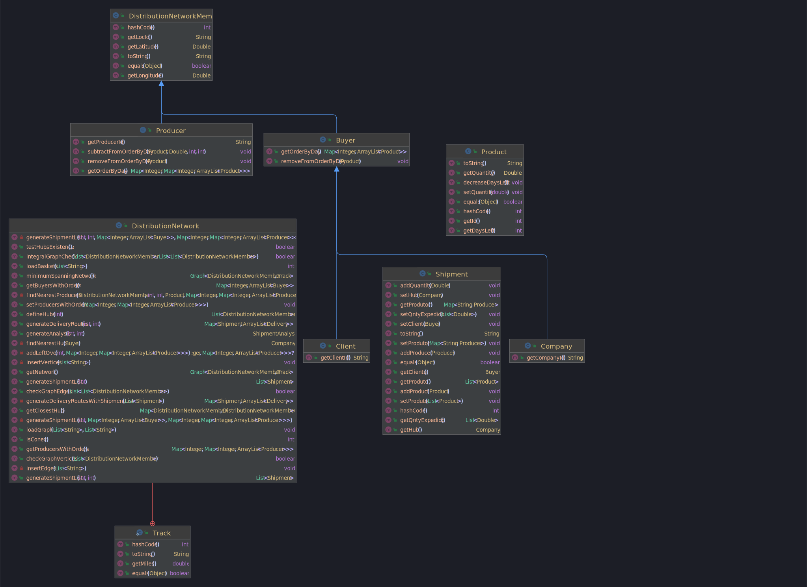

# US309 – US309 - Gerar uma lista de expedição para um determinado dia que forneça apenas com os N produtores agrícolas mais próximos do hub de entrega do cliente.

### 1.1. Descrição da User Story

- Durante a execução do programa deve ser possível:
  * Gerar uma lista de expedição para um determinado dia com os N produtores agrícolas mais próximos do hub de entrega 
  do cliente e que contenha informação sobre os produtores que abastecem o cliente, os produtos que cada produtor irá 
  entregar para esse dia, a quantidade de cada produto, o hub de entrega e o cliente 

### 1.2. Clarificações e especificações do cliente

* FALTA ADICIONAR AS ESPECIFICAÇÕES DO CLIENTE

### 1.3. Critérios de aceitação

* **CA1:**  O programa deve ser capaz de gerar uma lista de expedição para um determinado dia com os N 
produtores agrícolas mais próximos do hub de entrega do cliente.
* **CA2:**  A lista de expedição deve conter informação sobre os produtores que abastecem o cliente, os produtos,
a quantidade de cada produto, o hub de entrega e o cliente. 
* **CA3:**  Os produtores devem ser ordenados por ordem crescente de distância ao hub de entrega do cliente e será 
por essa ordem que os produtores terão a prioridade na entrega dos produtos.
* **CA4:**  O hub de entrega deve ser o mais próximo em distância ao cliente.
* **CA5:**  Os produtos para o dia seguinte devem ser atualizados de acordo com o que foi entregue no fim do dia.
* **CA6:**  Os produtos devem ser ordenados por ordem decrescente da sua data de validade. O produto com a data de
validade mais próxima deve ser entregue primeiro.
* **CA7:**  A quantidade de produtos a entregar deve ser a quantidade necessária para abastecer o cliente.
* **CA8:**  O produto com a data de validade vencida ou com quantidade esgotados não deve ser entregue nem atualizados.
* **CA9:**  Não podem existir clientes sem produtos que abastecer.
* **CA10:** Não pode ser inserido um número negativo de produtores que irão abastecer ao cliente.
* **CA11:** Não pode ser inserido um dia que não exista dentro do sistema.
* **CA12:** Não pode ser corrido o programa sem que exista dados carregados de clientes, produtores e produtos. 
Ou sem que os hubs sejam definidos.

### 1.4. Dependências

* US301 - Carregar os dados de clientes, produtores e produtos
* US303 - Definir os hubs da rede de distribuição
* US304 - Para cada cliente (particular ou empresa) determinar o hub mais próximo
* US307 - Carregar os cabazes

### 1.5 Dados de Input e Output

#### CA1
**Input:**

* Dia a gerar a lista de expedição
* Número de produtores que irão abastecer o cliente
* Map com todos clientes por dia que precisam de abastecimento. 
* Map com todos produtores por produto e por dia que irão abastecer os clientes.

**Output:**
* Lista de expedição para o dia selecionado com os N produtores agrícolas mais próximos do hub de entrega do cliente.
* Map com a lista de expedição para esse dia.

# 2 Class Diagram (CD)



# 3. Implementação

* CA1
    * Exemplo da função que gera a lista de expedição para um determinado dia com os N produtores agrícolas mais próximos do hub de entrega do cliente.

```
    public List<Shipment> generateShipmentList(int day, int n, Map<Integer, ArrayList<Buyer>> buyersWithOrders, Map<Integer, Map<Integer, ArrayList<Producer>>> producersWithOrders) {

        /*Retornar null se o número de produtores for menor ou igual a 0*/

        if(n<=0){
            throw new IllegalArgumentException("O número de produtores tem de ser maior que 0");
        }

        /* Retornar null se não existirem hubs definidos no sistema */

        if (hubs.size()==0){
            throw new IllegalArgumentException("Não existem hubs definidos no sistema");
        }

        boolean flag=false;
        /*Declarar e inicializar a lista de expedições*/

        List<Shipment> shippingList = new ArrayList<>();


        /*Declarar e inicializar as listas com os dados necessários para criar um Shipment(expedição)*/

        Map<String, Producer> produtor = new HashMap<>();
        List<Double> qntyExpedido = new ArrayList<>();
        List<Product> produto = new ArrayList<>();

        /*Declarar e inicializar a lista que armazena todos os clientes e empresas no grafo */

        ArrayList<Buyer> clientes = buyersWithOrders.get(day);

        /*Iterar a lista de clientes no grafo*/

        if (clientes!=null) {
            for (Buyer member : clientes) {

                ArrayList<Product> products = member.getOrderByDay().get(day);

                /* Obtemos o hub mais próximo para o cliente em especifico */

                Company hub =  findNearestHub(member);

                for (Product product : products) {
                    flag = false;
                    /* Obtemos os N produtores mais próximos para o hub obtido */

                    List<Producer> closestProducers = findNearestProducers(hub,n,day,product,producersWithOrders);

                    // Itera-se a lista dos N produtores mais próximos ao hub
                    if (closestProducers != null) {
                        for (Producer producer :closestProducers) {
                            // Obtemos a lista de produtos do produtor para o dia em especifico
                            List<Product> productsForDayOfProducer = producer.getOrderByDay().get(day).get(product.getId());

                            /* Iteramos a lista de produtos dos clientes por cada iteração da lista de produtos do produtor e verificamos
                            se possuem o mesmo produto, caso sim, verifica-se então se o produtor pode suplir ao cliente, cujo caso é adicionado
                            às listas os dados para criação de um Shipment */

                            if (productsForDayOfProducer!=null) {
                                for (int i = productsForDayOfProducer.size()-1; i>=0 ; i--) {
                                    Product prodProducer = productsForDayOfProducer.get(i);
                                    if (product.getQuantity() <= prodProducer.getQuantity()) {
                                        produto.add(product);
                                        produtor.putIfAbsent(producer.getLocId(), producer);
                                        qntyExpedido.add(product.getQuantity());
                                        // Restamos a quantidade do produto vendido do produtor
                                        producer.subtractFromOrderByDay(prodProducer,product.getQuantity(), day,i);
                                        flag = true;
                                        break;
                                    }
                                }
                                if (flag){break;}
                            }
                        }
                    }
                }
                shippingList.add(new Shipment(member,hub,produtor,qntyExpedido,produto));
                produto= new ArrayList<>();
                produtor= new HashMap<>();
                qntyExpedido= new ArrayList<>();
            }
            shipmentListOrderByDayWithRestrictions.put(day,shippingList);
            addLeftOver(day,producersWithOrders);
            return shippingList;
        }
        throw new IllegalArgumentException("Não existem clientes com encomendas para o dia "+day+" definidos no sistema");
    }
```

# 4. Testes

**Teste:** Teste quando existe uma lista de expedição, não há valores nulos e  são atualizados os dados para o dia seguinte
```
    @Test
    public void testGenerateShipmentList_noNullParamsDay2_Small() {
        distributionNetworkUS309_small.defineHubs(10);
        int day = 2;
        int n = 3;

        //Geração de dados dos clientes
        Buyer buyer1 = new Buyer("CT4", 41.7, -8.8333);

        buyer1.getOrderByDay().put(1, new ArrayList<Product>(Arrays.asList(new Product( 1, 2.2),new Product( 2, 3.3))));
        buyer1.getOrderByDay().put(2, new ArrayList<Product>(Arrays.asList(new Product( 1, 4.8),new Product( 2, 3.0))));

        Buyer buyer2 = new Buyer( "CT3", 41.5333,-8.4167);

        buyer2.getOrderByDay().put(1, new ArrayList<Product>(Arrays.asList(new Product( 1, 5.0))));
        buyer2.getOrderByDay().put(2, new ArrayList<Product>(Arrays.asList(new Product( 1, 2.0),new Product( 2, 3.0))));

        //Geração de dados dos produtores
        Producer producer1 = new Producer("CT1", 40.6389, -8.6553,"P1");

        Map<Integer,ArrayList<Product>> order1 = new HashMap<>();
        order1.put(1, new ArrayList<Product>(Arrays.asList(new Product( 1, 7.0))));
        order1.put(2, new ArrayList<Product>(Arrays.asList(new Product( 2, 3.3))));

        Map<Integer,ArrayList<Product>> order2 = new HashMap<>();
        order2.put(2, new ArrayList<Product>(Arrays.asList(new Product( 2, 2.0))));

        producer1.getOrderByDay().put(1, order1);
        producer1.getOrderByDay().put(2, order2);

        Map<Integer,ArrayList<Product>> order3 = new HashMap<>();
        order3.put(1, new ArrayList<Product>(Arrays.asList(new Product( 1, 5.0))));

        Map<Integer,ArrayList<Product>> order4 = new HashMap<>();
        order4.put(1, new ArrayList<Product>(Arrays.asList(new Product( 1, 1.0))));
        order4.put(2, new ArrayList<Product>(Arrays.asList(new Product( 2, 6.0))));

        Producer producer2 = new Producer( "CT6", 41.1495,-8.6108, "P2");

        //Geração de dados para o mapa de produtor do shipment
        producer2.getOrderByDay().put(1, order3);
        producer2.getOrderByDay().put(2, order4);

        Map<String, Producer> produtor1 = new HashMap<>();
        Map<String, Producer> produtor2 = new HashMap<>();

        produtor1.put("CT6", producer2);
        produtor2.put("CT1",producer1);
        produtor2.put("CT6", producer2);

        //Geração de dados para buyersWithOrders
        Map<Integer, ArrayList<Buyer>> buyersWithOrders = new HashMap<>();
        buyersWithOrders.put(1, new ArrayList<>(Arrays.asList(buyer1, buyer2)));
        buyersWithOrders.put(2, new ArrayList<>(Arrays.asList(buyer1, buyer2)));

        //Geração de dados para producersWithOrders
        Map<Integer, Map<Integer, ArrayList<Producer>>> producersWithOrders = new HashMap<>();

        Map<Integer, ArrayList<Producer>> day1Producers = new HashMap<>();
        day1Producers.put(1, new ArrayList<>(Arrays.asList(producer1, producer2)));
        day1Producers.put(2, new ArrayList<>(List.of(producer1)));

        Map<Integer, ArrayList<Producer>> day2Producers = new HashMap<>();
        day2Producers.put(1, new ArrayList<>(Arrays.asList(producer1, producer2)));
        day2Producers.put(2, new ArrayList<>(Arrays.asList(producer1, producer2)));

        producersWithOrders.put(1, day1Producers);
        producersWithOrders.put(2, day2Producers);

        //Obtenção dos shipments
        List<Shipment> shipmentsActual = distributionNetworkUS309_small.generateShipmentList(day, n);

        Company hub1 = new Company("CT2", 38.0333, -7.8833,"E1");
        Company hub2 = new Company("CT5", 41.3002, -7.7398,"E2");

        //Geração de um shipment
        List<Shipment> shipmentsExpected = new ArrayList<>();
        shipmentsExpected.add(new Shipment(buyer1,hub2,produtor1, List.of(3.0),Arrays.asList(new Product( 2, 3.0))));
        shipmentsExpected.add(new Shipment(buyer2,hub1,produtor2, Arrays.asList(2.0,3.0), Arrays.asList(new Product(1,2.0),new Product(2, 3.0))));

        assertEquals(shipmentsExpected,shipmentsActual);
    }
```