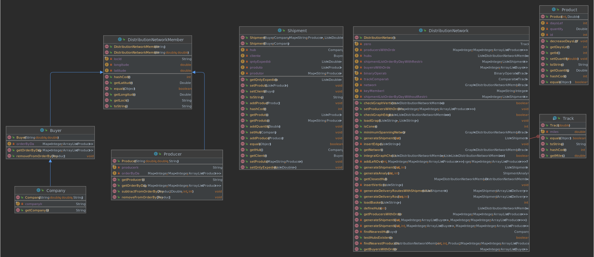

# US310 - Para uma lista de expedição diária gerar o percurso de entrega que minimiza a distância total percorrida

## 1. Requerimentos

### 1.1. Descrição da User Story

Para uma lista de expedição diária gerar o percurso de entrega que minimiza a distância
total percorrida

### 1.2. Clarificações e especificações do cliente
Nenhuma

### 1.3. Critérios de aceitação
* CA - Indicar os pontos de passagem do percurso (produtores e hubs), cabazes
  entregues em cada hub, distância entre todos os pontos do percurso e a distância total.
### 1.4. Dependências
* US307
* US308
* US309


### 1.5 Dados de Input e Output
**Input:**
* Dia 
* Lista de expedição

**Output:**
* Rotas de entrega


## 2 Class Diagram (CD)



# 3. Testes

**Teste 1:** Teste quando não existe uma lista de expedição
```
@Test
    public void generateDeliveryRoutesNullExpeditionList(){
        distributionNetworkUS308.defineHubs(1);
        distributionNetworkUS308.generateShipmentList(1);
        // Day 2 expedition list was not created, so it should be null
        Map<Shipment,ArrayList<Delivery>> result = distributionNetworkUS308.generateDeliveryRoutes(2,1);
        assertNull(result);
    }

```
 


# 4. Implementação

```
/**
     * Generates all the routes for the expedition list
     * @param shipmentList the expedition list to generate the routes
     * @return each route associated with each respective shipment
     */
    private Map<Shipment,ArrayList<Delivery>> generateDeliveryRoutesWithShipmentList(List<Shipment> shipmentList){
        if (shipmentList == null){
            return null;
        }

        Map<Shipment,ArrayList<Delivery>> finalRoutes = new HashMap<>();

        for (Shipment shipment : shipmentList) {
            ArrayList<Delivery> shipmentRoutes = new ArrayList<>();

            ArrayList<LinkedList<DistributionNetworkMember>> paths = new ArrayList<>();
            ArrayList<Track> dists = new ArrayList<>();
            Algorithms.shortestPaths(network,shipment.getHub(),trackComparator,binaryOperator,zero,paths,dists);

            for (Producer producer : shipment.getProdutor().values()){
                LinkedList<DistributionNetworkMember> path = paths.get(network.key(producer));
                Collections.reverse(path);
                shipmentRoutes.add(new Delivery(path,dists.get(network.key(producer))));
            }
            finalRoutes.put(shipment,shipmentRoutes);
        }

        return finalRoutes;
    }
```
