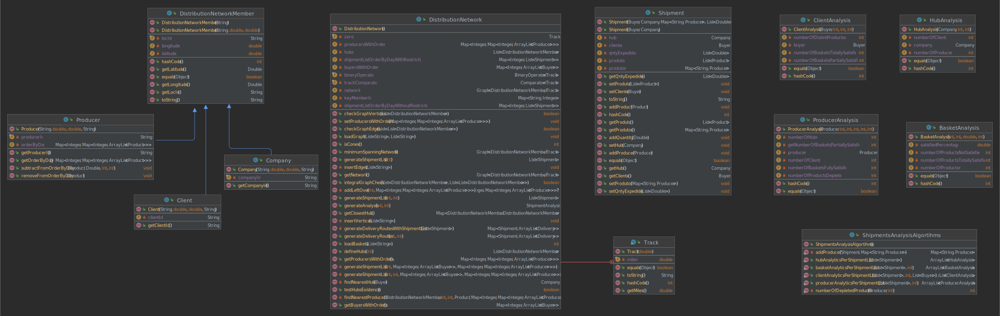

# US310 - Para uma lista de expedição calcular estatísticas

## 1. Requerimentos

### 1.1. Descrição da User Story

Para uma lista de expedição calcular estatísticas:  
* por cabaz: nº de produtos totalmente satisfeitos, nº de produtos parcialmente satisfeitos, nº
de produtos não satisfeitos, percentagem total do cabaz satisfeito, nº de produtores que
forneceram o cabaz.  
* por cliente: nº de cabazes totalmente satisfeitos, nº de cabazes parcialmente satisfeitos, nº
de fornecedores distintos que forneceram todos os seus cabazes  
* por produtor: nº de cabazes fornecidos totalmente, nº de cabazes fornecidos parcialmente,
nº de clientes distintos fornecidos, nº de produtos totalmente esgotados, nº de hubs
fornecidos.  
* por hub: nº de clientes distintos que recolhem cabazes em cada hub, nº de produtores
distintos que fornecem cabazes para o hub.


### 1.2. Clarificações e especificações do cliente
Nenhuma

### 1.3. Critérios de aceitação


### 1.4. Dependências
* US307
* US308
* US309


### 1.5 Dados de Input e Output
**Input:**
* Dia 
* Lista de expedição

**Output:**
* Estatísticas necessárias


## 2 Class Diagram (CD)



# 3. Testes

**Teste 1:** Teste quando não existe uma lista de expedição
```
    @Test
    public void generateAnalysisTestNull() {
        distributionNetworkSmall.defineHubs(10);
        ShipmentAnalysis shipmentAnalysis = distributionNetworkSmall.generateAnalysis(1,2);
        assertNull(shipmentAnalysis);
    }
```
 


# 4. Implementação

**Exemplo 1:** Cálculo das estatisticas para os cabazes

```
public static ArrayList<BasketAnalysis> basketAnalyticsPerShipmentList(List<Shipment> shipments, int day){

        int numberOfProductsTotallySatisfied;
        int numberOfProductsNotSatisfied;
        double satisfiedPercentage;
        int numberOfProductors;

        ArrayList<BasketAnalysis> listBasketAnalytics = new ArrayList<>();
        for (Shipment ship: shipments) {
            if (!ship.getProdutor().isEmpty()) {
                numberOfProductsTotallySatisfied = ship.getProduto().size();
                numberOfProductors = ship.getProdutor().entrySet().size();
                satisfiedPercentage = ( ((double)(numberOfProductsTotallySatisfied)/ship.getCliente().getOrderByDay().get(day).size())*100);
            }else{
                numberOfProductsTotallySatisfied = 0;
                numberOfProductors = 0;
                satisfiedPercentage = 0;
            }
            numberOfProductsNotSatisfied = (ship.getCliente().getOrderByDay().get(day).size() - ship.getProduto().size());
            listBasketAnalytics.add(new BasketAnalysis(numberOfProductsTotallySatisfied,
                    numberOfProductsNotSatisfied, satisfiedPercentage, numberOfProductors));

        }
        return listBasketAnalytics;
    }
```
